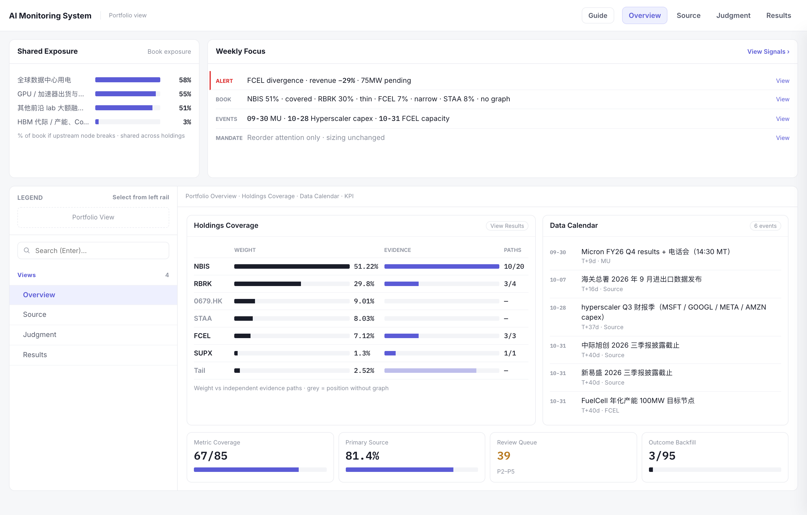
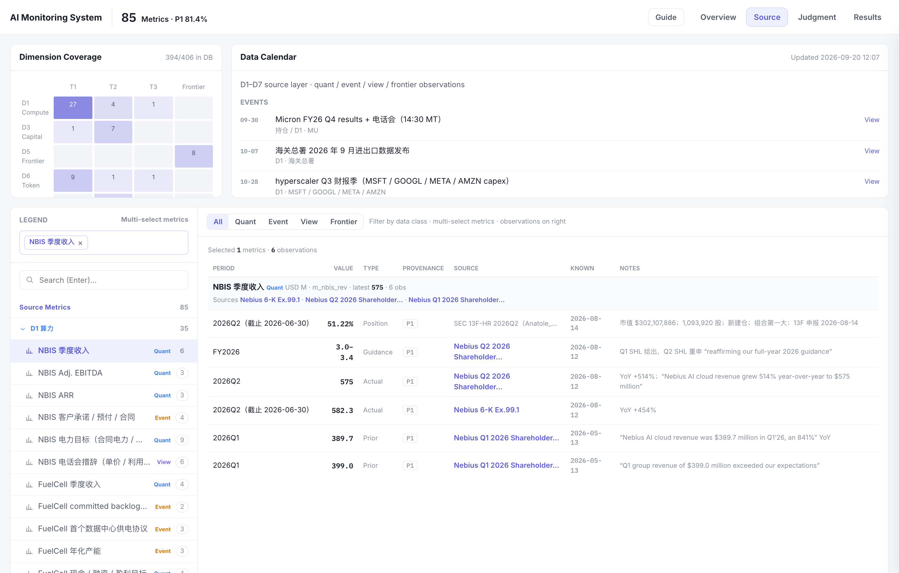
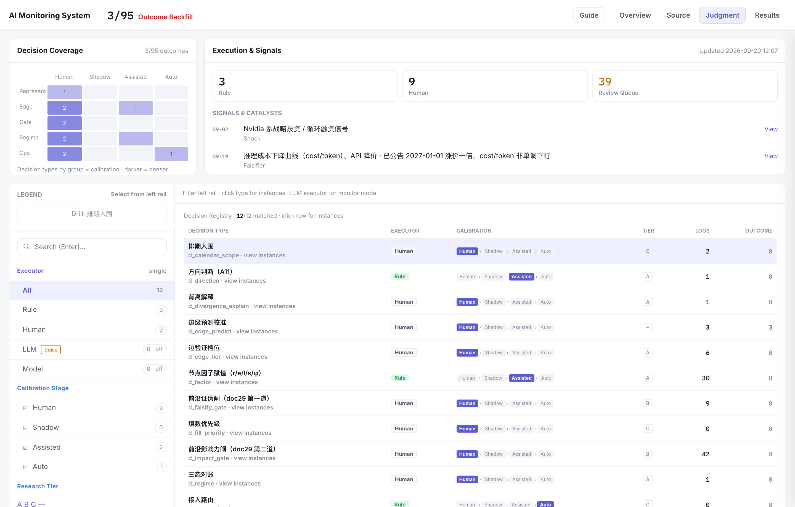
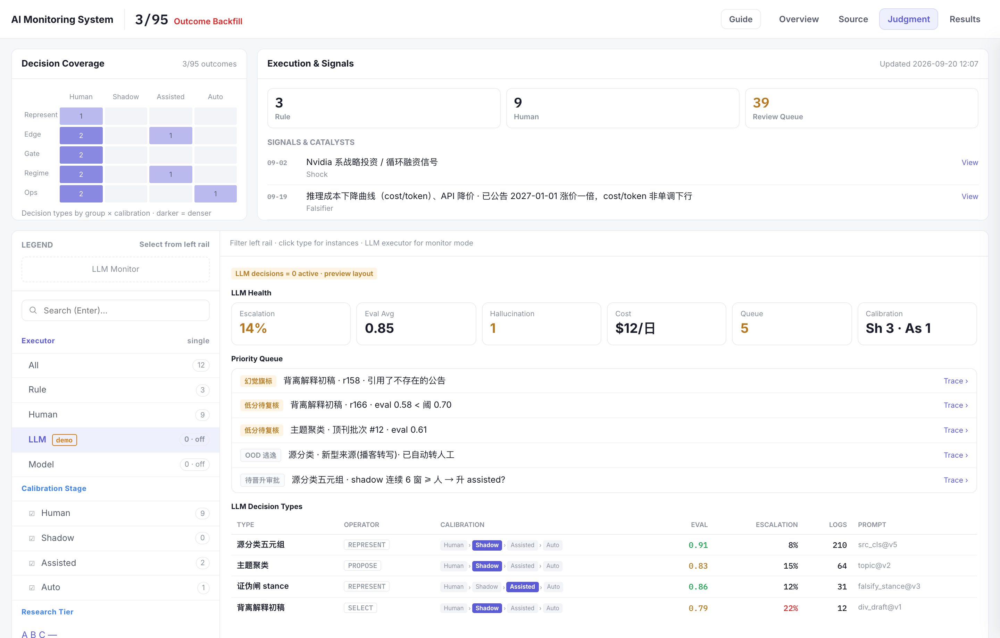
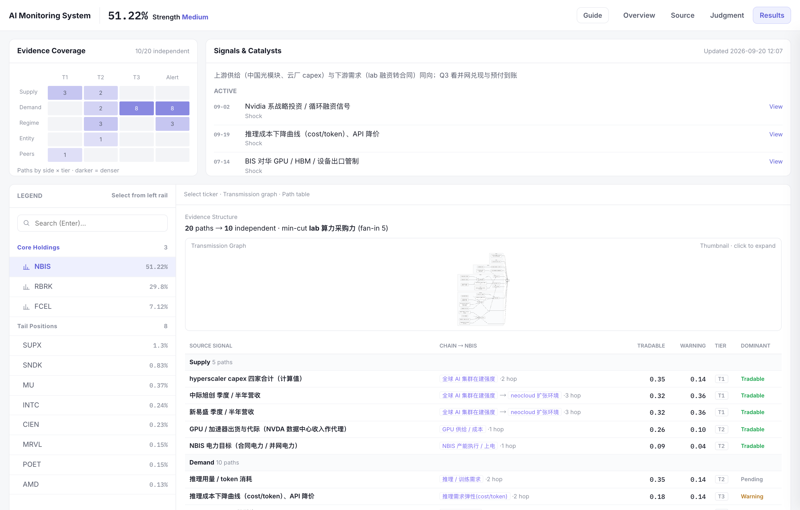

**图 · AI 发展监测体系总览**

 

 

<blockquote>

真正 proprietary 的东西也会从 prompt 向下移动：候选空间怎么构造，什么时候扩大和剪枝，state 保留什么，什么置信度可以自动执行，什么时候升级 frontier reasoning，failure 怎么 recovery，trajectory 如何进入下一轮 learning。这些今天看起来很“脏”的 Harness 工作，很可能逐渐构成一个 Agent 最重要的 intelligence architecture。

——孟醒 · <a href="https://mp.weixin.qq.com/s/m2NUWypKHN3Lv857aNVhSg">《JEV火了，但真正重要的不是JEV》</a>

</blockquote>

---

## 阅读指南

1. **本页目录**
   1. [I. 破题与定位：信息降维与需求锚定](#i-破题与定位信息降维与需求锚定)
   2. [II. 点边表征：Intelligence Graph 计算循环](#ii-点边表征intelligence-graph-计算循环)
   3. [III. 三层架构：落地与工程体系](#iii-三层架构落地与工程体系)
   4. [IV. 示例：以 NBIS 为例的全链路推演](#iv-示例以-nbis-为例的全链路推演)
   5. [V. 监测面板：投研决策入口](#monitoring-panel)
   6. [VI. 终局：数据资产沉淀与未来迭代](#vi-终局数据资产沉淀与未来迭代)
   7. [附录：人机协作纪实](#附录人机协作纪实)
2. **重要参考**
   - 决策链路：[docs/22](docs/22-解题思路与分工.md)
   - 数据源与处理链路：[docs/21](docs/21-数据来源与处理方法说明.md)
   - 分叉与取舍：[docs/23](docs/23-解题思路.md)
   - 监测面板：[AI Monitoring System](https://creatoraix.top/AI-Monitoring-System/)
   - 工程复现：[pipeline/README.md](pipeline/README.md)

---

## I. 破题与定位：信息降维与需求锚定

> **核心思路**：从基金 13F 持仓反向确定监测范围，沿产业链做信息降维，换取领先期（Lead Time）与 Nowcast。

“监测 AI 发展”是一个过于宽泛的命题。从对冲基金数据资产沉淀的视角出发，我们需要的是能够支持最终投资决策的因果链。破题先拆需求侧与 AI 侧，再对齐筛选观测信号：

*   **需求侧锚定 (Demand-anchored)**：必须从基金当前的 13F 真实持仓（如 NBIS、RBRK）及未来目标票池出发，反向逆推我们需要监测的 AI 节点。通过将“AI 供给”与“持仓需求”进行科学溯源的对接，过滤出高信噪比的观测信号候选池。
*   **AI 侧信息降维 (Information Funnel)**：从 Science Lab 到创业公司再到上市公司，信息沿漏斗降维。漏斗标定三件事：**可靠性 / 确定性**（越往下越可对账）、**重要性梯度**（能否接到持仓）、**领先期**（越往上 Lead Time 越长）。在此之上，再按产业链拆为 **D1–D7**，便于观测对象的采集与管理。

**表 · AI 侧信息降维：成熟度层 × 产业链分维**

| 监测层 | 典型对象 | 信号形态 | 领先期 | 确定性 | D1–D7 采集分维 | 投研用法 |
| :--- | :--- | :--- | :--- | :--- | :--- | :--- |
| **Science Lab / 前沿** | 顶刊、实验室、开源与榜单 | Paper、模型卡、评测、技术博客 | 最长 | 最低 | **D5** 能力与算法前沿为主；旁及 **D2** 数据权属、弱 **D4** | 雷达与主题预置 |
| **创业 / 未上市** | Frontier lab、neocloud、供应链中游 | 融资、合同、排产、出货、政策文本 | 中长 | 中 | **D3** 资本；**D1** 中游供给；早期 **D6**；**D7** 政策冲击常先打这里 | 领先指标与路径候选 |
| **上市公司** | 持仓与可比公司 | 财报、股东信、电话会、8-K / 巨潮 | 最短 | 最高 | **D1** 产业确认；上市 **D6**；可对账 **D7**；持仓本体 KPI | 验证终点与披露回写 |

> **产业链七维**：D1 算力供给 · D2 数据供给 · D3 资本 · D4 人才 · D5 算法与能力前沿 · D6 商用落地 / token 经济 · D7 政策 · 能源 · 安全（投入 D1–D4，能力 D5，变现 D6，regime D7）。

*   **观测信号池 (Signal Set)**：需求侧与 AI 侧对齐后，进入池的信号按节点五因子与边传导打分（[`metric_factor`](pipeline/SCHEMA.md#tbl-metric_factor) / `v_edge_calc`）。
    *   **节点五因子**：可靠 r、独家 e、可观测 / 信噪 s、频率 φ、固有领先 l。
    *   **边传导**：传导确定性 c、领先期 τ。
    *   **打分**：节点固有价值 `valuable = w_e·e + w_s·s + w_r·r + w_φ·φ`；落到持仓边上再拆 **可交易度** `tradable = c·r·s·φ`（Nowcast / 排序）与 **预警度** `warning = τ·l·e`（watchlist）。
    *   系数登记为假设，只用于排序，不进 Sizing（[`assumption`](pipeline/SCHEMA.md#tbl-assumption)）。

---

## II. 点边表征：Intelligence Graph 计算循环

> **核心思路**：面对极度非结构化、频率错位的底层数据，系统将其压成点（指标）与边（传导），再接入 Intelligence Graph 的计算循环，将大模型的开放式生成收敛为可量化的分类与路由。

**1. 底层数据约束 (Data Constraints)**
确定信号池并初步收集真实数据进行观测后，我发现下述三大问题并提出解决方案：
*   **非结构化极其严重**：建立强制降维规则，将形态各异的输入（Paper、宏观政策）压缩为标准化的事实表征。
*   **更新频率存在错位**：前沿突发事件与财报季度披露存在时差。系统必须具备跨周期对齐能力，通过计算“领先期（Lead Time）”抹平频率差。
*   **信噪比参差不齐**：建立严密的五级溯源体系（P1-P5）和八步处理 Pipeline。
*(注：受限于时间，本轮重点实证了 NBIS 等持仓，但针对整体大盘的收集规范与处理体系已全部落定，详见 [数据来源与处理方法说明](docs/21-数据来源与处理方法说明.md)。)*

**2. 指标节点与传导边 (Nodes & Edges)**
清洗后的数据只保留两类对象：
*   **点 (Nodes)**：AI 供给侧拆解为 7 个维度及前沿雷达。指标仅存定义，严格区分于事实本身。
*   **边 (Edges)**：边不仅代表关联，更具有方向、权重和脆弱性（如通过计算供应链“最小割”直接定位风险咽喉）；结合运筹学与信息论，量化信号的确定性衰减。每条边历经 T1(可回测)/T2(对账)/T3(定性) 三层验证（[`edge_registry` ↗](pipeline/SCHEMA.md#tbl-edge_registry)）。

**3. Intelligence Graph 计算循环**
> *灵感参考：孟醒[《JEV火了，但真正重要的不是JEV》](https://mp.weixin.qq.com/s/m2NUWypKHN3Lv857aNVhSg)——“统一接口（Token）不等于统一计算。能通过 Generation 表达的智能，不意味着都应该通过 Generation 计算。”*

为了进行投资判断，我们不需要大模型去“写一篇 3000 字的生成式研报”。在投研这种 Decision-native 的场景中，**扣动扳机是极低频的，但前期的信息筛选、验证、路由是极高频的。** 如果每一次微小的判断都启动自回归生成器，系统经济学将无法支撑。

因此，系统摒弃了单纯的 Prompt Engineering，转向 **Intelligence Orchestration（智能编排）**。我们将点边模型接入以下计算循环：
*   **REPRESENT (表征)**：这是耗时最长、最依赖 Harness 的一步。将外部非结构化长文，压缩成 Point-in-time 的标准化状态，提取出 Deterministic 的事实。
*   **PROPOSE (提出候选)**：当数据出现背离时，沿传导边展开，枚举出所有可能影响持仓的因果解释。
*   **PREDICT (预判)**：结合领先期评估该信号对未来 KPI 的影响幅度。
*   **SELECT (选择与剪枝)**：对有限候选空间给出排序分数，经证伪与影响力两道闸收窄；路径选择由研究员 / PM 写入 [`decision_log`](pipeline/SCHEMA.md#tbl-decision_log)，分数不进入 Sizing。

**图 · Intelligence Graph 计算循环**

---

## III. 三层架构：落地与工程体系

> **核心思路**：理论范式必须应对真实工程中的摩擦力。系统被切分为三层实体架构，以实现事实与假设的绝对解耦、AI 模型的可控管理（白盒化），以及向研究员直觉的高效折叠。

### 1. 数据层：事实与假设的解耦 (Data & Pipeline)
在投研中，最危险的是将主观预判当成客观事实。工程上必须做到物理隔离：
*   **绝对真实的底层**：底层只存储绝对干净的、遵循 P1-P5 溯源的事实记录（[`source_master` ↗](pipeline/SCHEMA.md#tbl-source_master)）。
*   **假设台账 (Assumptions Ledger)**：所有涉及主观预判的传导概率与权重系数，全部分离存入独立的“台账”（[`assumption` ↗](pipeline/SCHEMA.md#tbl-assumption)）。预测出现偏差只需调参，真实数据链绝不被污染。
*   **入库纪律**：指标定义与四类事实表分离，按 `采集 → 快照 → 抽取 → 路由 → 校验 → 迁移` 落库（[docs/21 §四](docs/21-数据来源与处理方法说明.md#四处理链从登记到看板) · [pipeline/README.md](pipeline/README.md)）。本轮由编号脚本 + `migrate.py` 执行；定时调度未接入，见第六节。

### 2. 治理层：执行路由与白盒化管理 (Governance)

**图 · 校准复盘双控制器闭环**

为了将 AI 从黑盒转变为可管理的系统组件，控制流被明确切分：
*   **三路执行路由**：确定性逻辑交给 **Code**（如关系映射、规则计算）；复杂的语义压缩交给 **LLM**；而最终的信号定档与方向复核，必须交由 **人工** 兜底。
*   **Agent Trace (设想与规划)**：未来的规划是全面接入 Langfuse。通过留存每一次 Prompt 与 Output 形成观测轨迹，并建立 Eval 机制对模型分类准确度持续打分，确保高精度数据资产沉淀。

### 3. 呈现层：监测面板
面板要沉淀的是对冲基金可以复用的数据资产，而不是资讯流的前端。

**使用对象**：研究员和 PM 在持有期内跟踪投资逻辑是否变化、在财报前判断预期差、并在必要时核验管理层表述；数据岗核验来源分级、判断执行方、校准阶段与事后回写。采集与入库仍在库侧完成。

**目标**：在公司正式披露之前，把已经观测到的上游变化，转成对持仓有意义的领先判断（Lead Time / Nowcast）：影响哪只股票、依据有多硬、下一步用什么来验证。额外价值来自先锚定持仓、再沿产业链分层，而不是把公开新闻再铺一层。

**呈现层次**：
*   **持仓扫描**：哪些持仓证据偏薄；哪些上游变化会同时影响多只持仓；本周需要跟踪的数据时点。
*   **事实溯源**：数值来自哪里、可信级别、何时可知、实际值与公司指引如何对照。
*   **判断记录**：判断由谁作出、处在哪一校准阶段、事后是否回写结果。
*   **持仓传导**：上游信号如何传到具体持仓；哪些路径用于 Nowcast 排序，哪些只进入预警。

界面按上述层次对应 Overview / Source / Judgment / Results，数据同源。在线：[AI Monitoring System](https://creatoraix.top/AI-Monitoring-System/)。各层画面见 [第五节](#monitoring-panel)。

---

## IV. 示例：以 NBIS 为例的全链路推演

> **核心思路**：事实表征与因果假说解耦；披露前完成路径选择；披露后将结果回写为可回放的校准记录。沉淀的是判断轨迹，而非单次预测命中。

这一节用 **NBIS**（2026 Q2 13F 约 51%）把前面的点边与计算循环跑通一遍：披露前只使用当时可见的事实，枚举互斥解释并选定一条路径；披露后再把结果回写，看哪条成立、下次该改哪一层。窗口是 Q1 股东信日 **2026-05-13** 到 Q2 披露日 **2026-08-12**。

**图 · NBIS 供需对账**

### 4.1 REPRESENT · 事实表征（不含因果解释）

季报由 **Code** 解析，股东信与电话会由 **LLM** 抽取，统一写入 [`fct_quant`](pipeline/SCHEMA.md#tbl-fct_quant)。回测仅允许使用 `knowledge_time` 不晚于决策时点的记录。

**表 · REPRESENT 事实入账（Q2 披露前 as-of）**

| 传导链 | 事实（as-of Q2 披露前） | knowledge_time |
| :--- | :--- | :--- |
| **供给** | 旭创 Q1 营收 **195 亿元，YoY +192%**（`r320`）；新易盛 Q1 **83 亿元，YoY +106%**（`r328`） | 04-17 / 04-24 |
| **需求** | Reflection 融资 **$2B**，随后与 NBIS 签订算力合同 **$1B**（`r404` / `r406`）；OpenAI $122B、Anthropic $65B | 截至 07-14 |
| **公司** | 合同电力 **>3.5 GW**，年底指引 **>4 GW**；并网 / 可上架 **800 MW–1 GW**（已并网容量 ≠ 合同电力）；Q1 AI cloud **$389.7M**；FY 指引 **$3.0–3.4B** | 05-13 |

抽取职责止于字段映射：旭创一季报 → `r320` actual；Q1 股东信 “more than 4 GW” → `r255` guidance。海关月报保持 placeholder，不进入后续候选空间。

### 4.2 PROPOSE · 互斥候选空间

观测到的信号分两块。上游已经扩张：光模块营收大增、Reflection **$1B** 合同落地、合同电力 **>3.5 GW**。公司侧尚未同步：并网仍 **800 MW–1 GW**，Q1 AI cloud 仍是 **$389.7M**。

由此出现可观测冲突：上游供给与订单已确认扩张，并网容量与上季收入尚未同步。据此可以推出三条互斥路径：

*   **A 天花板**：并网容量构成当期硬约束
*   **B 时差**：产能领先于收入入账
*   **C 打穿全年**：当季加速，且全年指引上修

**图 · NBIS 传导结构、可观测冲突与候选空间**

披露前三条均未被证伪：

**表 · PROPOSE 互斥候选 A / B / C**

| 候选 | 因果解释 | 对 Q2 的可证伪预测 | 头寸含义 |
| :--- | :--- | :--- | :--- |
| **A 天花板** | 并网容量构成当期硬约束 | 收入仍接近 Q1 **$390M** | 不增加敞口，等待并网数据 |
| **B 时差** | 并网滞后于合同电力；按假设 B4（产能领先收入约 90 天）计入 Q2 | **环比显著高于 Q1**；不要求 FY 指引上修 | 偏向增持 |
| **C 打穿全年** | 需求强度足以迫使 FY **$3.0–3.4B** 上修 | 当季加速 **且** 全年指引上修 | 提高进攻性敞口 |

### 4.3 SELECT · 披露前路径选择

面对上面三条均未被证伪的路径，实际流程是：系统（Code / LLM）摊开候选空间、各自的证伪条件与排序分数；**研究员 / PM** 在窗口内拍板，写入 [`decision_log`](pipeline/SCHEMA.md#tbl-decision_log)。路径选择进假设台账，未完成校准前禁止自动执行。本例窗口截止 **2026-08-12 开盘前**。

下文**假设**拍板结果为 **B**（工作假设，不是已知事实）：合同电力与订单已落地，更符合入账时滞而非当期硬约束，并调用假设 B4（产能领先收入约 90 天，[`assumption`](pipeline/SCHEMA.md#tbl-assumption)）。A、C 仍留在池里，等披露后对账。

### 4.4 校准 · 披露后回写

承接上文：假设已选 **B**，并采用假设 B4（产能领先收入约 90 天）。披露后不改事前选择，只按 A / B / C 各自的可证伪预测对账，outcome 回写 [`decision_log`](pipeline/SCHEMA.md#tbl-decision_log)。

*   **事后更接近 A**（收入仍贴着 Q1 ~$390M）：选 B 记 **wrong**。同类状态下对 B 降权、对 A 升权；回假设台账复核 B4 的 90 天是否过短，或并网确为硬约束。事实表不动。
*   **事后更接近 B**（当季环比显著高于 Q1，全年指引不上修）：选 B 记 **correct**，B4 记一次校准样本。本例落在这里：AI cloud **$575M**（QoQ **+47.6%**），集团 **$582.3M**，ARR $1.92B → **$3.0B**，FY 仍 **$3.0–3.4B**。
*   **事后更接近 C**（当季加速 **且** FY 指引上修）：选 B 记 **mixed / wrong**——序列收入可以对上 B，全年跳跃不在 B 的覆盖范围。C 保持独立路径，禁止把 B 自动晋升为 C。若 C 当时不在池里，才回到 **PROPOSE** 补候选。

三种落点决定下一轮改哪一层：路径选错改 **SELECT**；解释当时没枚举改 **PROPOSE**；字段抽错改 **REPRESENT**；时滞天数不准改 **B4**。本例 SELECT 命中、C 独立记不成立，无需改 REPRESENT / PROPOSE。

### 4.5 迭代 · 轨迹与评测

这些回写构成可回放轨迹，用来迭代，而不是停在单次对错：
1. **轨迹**：每次 SELECT 记一条 rollout。observation = 当时可见的 `state_anchor`；action space = {A, B, C}；action = 拍板路径；delayed reward = 披露后的 correct / wrong / mixed。
2. **评测**：看置信度是否等于命中率，以及事后成立的路径当时是否在池内。
3. **训练（规划）**：SELECT 做成离散动作上的 policy head，输出 P(路径 | 状态)；REPRESENT 的抽取轨迹接入 Langfuse，用 span-level eval 迭代抽取器。未完成校准前，拍板仍由研究员 / PM 执行。

工程底座：[`checks.py`](pipeline/checks.py) 拦截未验证假设进入 Sizing；`change_log` 按 as-of 重放当时可见记录；`v_health` 监测信源时效。

---

## V. 监测面板：投研决策入口

> **核心思路**：把非结构化监测收成可调用、可对账的数据资产，再交给投研决策链使用。研究员和 PM 用来在披露前跟踪领先变化、核验投资逻辑；数据岗用来核验来源分级、判断记录与校准状态。入口按决策链分成四层：持仓扫描、事实溯源、判断记录、持仓传导。在线：[AI Monitoring System](https://creatoraix.top/AI-Monitoring-System/)。

### 5.1 持仓扫描 · Overview

本屏回答：**这周组合层面有什么系统性风险、该先盯哪几只票。** 不做单票深钻，只做优先级排序。

*   **Shared Exposure（共享暴露）**：有些上游节点（如 hyperscaler capex、GPU 供给）被**多只持仓共用**。若该节点**恶化或击穿关键假设**，会**同时冲击**组合里多大比例仓位——条形图上的 % 就是「这一环出问题，会波及多少仓」。
*   **Weekly Focus（本周焦点）**：人工策展的待办条：**Alert** 突发冲击 · **Portfolio** 持仓快照 · **Events** 临近数据点 · **Mandate** 本周必须跟进的动作；点条目可跳到 Source / Results。
*   **Holdings Coverage（持仓覆盖）**：各持仓的**仓位权重** vs **独立证据路径数**；权重高但路径少的，点进 **Results** 细看传导链。
*   **Data Calendar（数据日历）**：**已排期的披露与数据发布**（财报、海关、产能节点等），不是新闻流；用来提前安排对账。
*   **底栏 KPI**：指标覆盖率 · P1 一手源占比 · 待人复核队列 · 判断 outcome 回填率（当前 **3/95**）——管道健康度，不是买卖信号。

**图 · Overview**

### 5.2 事实溯源 · Source

对应**数据层**。Results 上看到的任何数，都应回到这里**对账、查来源**。

*   **Dimension Coverage（维度覆盖）**：热力图看 **AI 产业链七维 D1–D7**（算力 / 数据 / 资本 / 人才 / 算法前沿 / 商用落地 / 政策能源，见 [第一节](#i-破题与定位信息降维与需求锚定)）在各**证据档位**上有没有指标、有多厚：
    *   **T1** = 可回测（有历史序列、能算）
    *   **T2** = 结构 + 真值对账（点少，靠结构论证与事后核验）
    *   **T3** = 定性 / 方向（只能判方向，不能精算）
    *   **Frontier** = 前沿 / 未上市对象（多为事件型、占位或低确定性数据）
*   **Data Calendar**：与 Overview 同源，但在这里**点事件会直接选中对应指标**，方便溯源。
*   **左栏 Source Metrics**：按 D1–D7 展开的指标树，支持多选与搜索；可按 **Quant**（量价序列）/ **Event**（事件）/ **View**（观点）/ **Frontier**（前沿）过滤。
*   **右栏 Observations**：选中指标的**逐条观测**——期间、数值、类型、溯源 P 级、原文链接、知悉日。若出现「占比系数未标定，不出定量」，表示这条序列还不能当金额用：海关 HS8517 是通信设备大类，光模块只占其中一部分，换算比例（假设 C1）尚未标定，系统**故意不给出数量/金额**，只作方向占位。

**图 · Source**

### 5.3 判断记录 · Judgment

对应**治理层**：登记每一次拍板是否可回放。本轮多数记录仍为规则 / 模型初稿（draft），outcome 回写 **3/95**；校准样本不足，Assisted / Auto 执行档保持关闭。LLM 专项见 5.4。

*   **Outcome Backfill（顶栏）**：已有多少条判断**事后回填了结果**（预测对不对），相对总日志数的完成率——看闭环有没有断。
*   **Decision Coverage（决策覆盖）**：热力图，用来找「还在人工、该升档」的空白格。颜色越深 = 该类型在该阶段积累的记录越多。
    *   **行 · 五类判断分组**：**Represent**（源怎么分类）· **Edge**（边怎么定档）· **Gate**（证伪 / 影响闸）· **Regime**（方向 / 背离解释）· **Ops**（路由 / 日历等运维）
    *   **列 · 校准阶段**：**Human**（纯人工）→ **Shadow**（影子试运行）→ **Assisted**（人机协同）→ **Auto**（可自动）
*   **Execution & Signals（执行与信号）**：三张计数卡——**Rule** = 规则 / code 自动执行的判断 · **Human** = 人工拍板 · **Review Queue** = 待人复核条数；下方是**待处理冲击**与**证伪信号** feed，链回 Source / Results。
*   **左栏筛选**：按**执行方**（Rule / Human / LLM）· **校准阶段** · **投研档 A/B/C** · **判断分组** · **Owner** 收窄登记表。
*   **Decision Registry（判断登记表）**：**12 类**具体判断（如源分类五元组、证伪 stance、方向选择…）各一行；点某行下钻到单条实例。这是未来校准 decision model 的训练样本。
    *   **表头列**：**谁执行**（Rule / Human / LLM）· **在校准漏斗哪一档** · **日志条数** · **outcome 条数**
    *   **单条实例 · 六元组**：当时看到了什么（state）→ 有哪些候选（candidates）→ 选了什么（choice）→ 置信度 → 依据 → 事后结果（outcome）

**表 · 判断类型字段对照**

| 字段 | 含义 | 字段 | 含义 |
| :--- | :--- | :--- | :--- |
| 排期入围 | 这条日程要不要纳入监测 | 方向判断 | 这条观测对持仓偏多还是偏空 |
| 背离解释 | 供需对不上时采用哪条解释 | 边级预测校准 | 这条传导事后有没有兑现 |
| 边验证档位 | 这条传导的证据有多硬 | 节点因子赋值 | 这条信号的质量怎么打分 |
| 前沿证伪闸 | 这条前沿消息能不能被证伪 | 填数优先级 | 下一步先补哪块数据 |
| 前沿影响力闸 | 这条前沿消息产业影响有多大 | 三态对账 | 实测、指引、上期是否对得上 |
| 接入路由 | 这条记录进哪张事实表 | 来源分级 | 这个来源可信到哪一级 |

**图 · Judgment**

### 5.4 LLM 校准 · Eval&Evolve

Judgment 左栏选 **LLM** 进入此模式。**Eval** = 抽取与分类准度；**Evolve** = 判断类型的执行档能否上移。Langfuse Trace 为规划中的评估依据，尚未接入。**当前 LLM 路由为 demo、在跑条数 = 0**；健康指标与优先队列为布局示意，不对应库内真实判断。

*   **LLM Health（健康概览）**：**升级率** = 低分自动转人工的比例 · **Eval 均分** · **幻觉旗标数** · **成本 / 调用量** · **待处理队列** · **Shadow / Assisted 各几类**——只放决策需要的摘要，不放 token 级 trace。
*   **Priority Queue（优先队列）**：今天要处理什么——**幻觉**（引用了不存在的来源）· **低分待复核**（eval 低于阈值）· **分布外逃逸（OOD）** = 遇到训练分布外的新情况（如从未见过的来源类型），模型置信度崩了，**自动转人工**而不是硬判。
*   **LLM Decision Types**：按 Intelligence Graph 三算子分列——**REPRESENT**（抽取 / 分类）· **PROPOSE**（提出候选 / 聚类）· **SELECT**（stance / 解释初稿等选择型）。看每类的 eval、逃逸率、日志量；**Shadow** = **影子阶段**：LLM 在后台跑并记 trace，**不真正接管**判断，等人标对比达标后再升到 **Assisted**（人机协同）或 **Auto**。

**图 · LLM 校准：Eval&Evolve**

### 5.5 持仓传导 · Results

**单票传导分析页**（Results）：与 [第四节 NBIS 推演](#iv-示例以-nbis-为例的全链路推演) 是**同一张传导图**的交互版，选定一只持仓后逐层下钻。阅读顺序建议：**选票 → 看覆盖哪里薄 → 追近期信号 → 读结构是否冗余 → 下钻逐条路径 → 回 Source 对账数字**。

顶栏 **Weight %** = 组合权重 · **Strength** = 独立证据路径深度（Weak / Medium / Strong），**不是买卖标签**。tradable / warning 等打分**只用于排序、决定先看哪条路径**，**不直接驱动加减仓**（不参与仓位 sizing 公式）。

*   **Holdings Rail（左栏）**：在核心仓 / 尾仓之间**切换当前分析的 ticker**。
*   **Evidence Coverage（证据覆盖）**：这只票的传导路径，按**五侧**（Supply 供给 · Demand 需求 · Regime 宏观政体 · Entity 本体 · Peers 竞对）× **证据档 T1–T3 / Alert** 看哪里密、哪里空——找 thesis 该 stress-test 的薄弱侧。
*   **Signals & Catalysts（信号与催化）**：**挂在这只票上的两件事**——① 近期**冲击**（价格异动、新闻 shock、宏观事件）② **待对账节点**（日历里快到期的披露 / 数据发布）。点条目可**过滤 Path Table** 或切换相关 ticker。
*   **Evidence Structure（证据结构）**：在进入长表之前先回答——一共有多少条传导路径、去重后多少**独立**路径（冗余度）、**最小割（min-cut）** 是哪一环（砍掉它 thesis 最脆弱）。用来判断「是不是只靠单一路径硬撑」。
*   **Transmission Graph（传导图）**：Mermaid 可视化 **上游因子 → 中间机制 → 持仓 ticker** 的因果链；适合向 PM / 复核人**讲故事**，不适合日常排序。
*   **Path Table（路径表）**：每一行 = 一条完整传导链（从哪个 Source Signal 出发、经几跳到达 ticker）。列 **Tradable**（可交易度）/ **Warning**（预警度）/ **Tier**（证据档）/ **Dominant**（是否主路径）——用来**分配注意力**：先看 warning 高、tradable 高的行。

**图 · Results**

---

## VI. 终局：数据资产沉淀与未来迭代

> **核心思路**：真正的护城河不是单次的个股预测，而是系统自身的运行纪律。基于对当前系统断点的诊断，把这套单票验证工具迭代为可横向复制的数据资产。

### 6.1 当前系统的断点与缺陷诊断
1. **回测深度不足，系数仍为假设**：目前的周频/季频数据多为近期的点状快照，缺乏历史时间序列。这导致“点边模型”中的权重和传导系数，绝大多数仍是停留在“假设台账”里的主观先验，无法达到 T1 级别的量化验证。
2. **缺乏自动化调度与排队机制**：虽然架构规划了 Code/LLM/人工的分工，但由于没有引入调度器，数据的采集、抽取和入库尚未形成真正的自动化流转。
3. **LLM 结果缺乏闭环监控**：目前的判断层多为 AI 初稿，但对 LLM 提取的准度缺乏系统的评估（Eval）和反馈循环。
4. **判断层未完成复核与 outcome 回写**：`decision_log` 以 draft 为主，事后结果回填 **3/95**。由于数据量尚少，尚不具备将执行档从 Human / Shadow 提升至 Assisted / Auto 的校准条件。

### 6.2 下一步的迭代路径与资源需求
针对上述断点，下一步的演进路径及所需资源如下：
1. **数据纵深回填与系数标定**
   *   **行动**：向历史回溯，补齐过去数个财季与周期的底层数据。
   *   **资源与工具**：需要额外的历史研报、行业数据库授权（如海关历史明细），以及用于大批量回测标定的算力资源。有了历史序列，我们才能将主观假设替换为统计显著的客观系数。
2. **打通自动化调度与 Eval 闭环**
   *   **行动**：引入工作流调度器（如 Airflow 或 Prefect），实现数据管道的定时、自动流转。同时，真实落地 Langfuse，收集 LLM 犯的错形成专属数据集，优化分类与抽取的准确度。
   *   **资源与工具**：需要云端的编排工具基建，以及早期需要更多的人力介入复核，以完成初期 Eval 数据集的标注。
3. **横向扩展：从单票样板到全域资产**
   *   **行动**：在上述基础设施（数据深度、调度、监控）跑稳的前提下，将 NBIS 的迁移脚本与处理逻辑复制到其他通用 AI 标的与未来目标票池中。
   *   **目标**：将这套被验证过的生产线，以极低的边际成本横向复制，最终实现从“验证当前持仓”向“自动推演并发现未来投资机会”的系统升级。

---

## 附录：人机协作纪实

> **协作方式**：人定问题边界、取舍标准与验收口径；AI 负责展开、落库与起草。先对齐上下文再动手，关键分叉由人拍板，过程中持续纠偏。以下为不同环节的原始截图，按时间顺序排列。

**相关文档**（与截图交叉对照）：[分叉与取舍 · docs/23](docs/23-解题思路.md)

### 1. 破题启动：手写框架 + 对齐上下文

题面拆解、手写推演，以及开场时要求 AI 先确认基金与任务背景，再按手稿框架推进。

**图 · 破题启动：手写框架与对齐上下文**

### 2. 交付物与拆解口径

明确最终要呈现的三块：解题思路（含聊天与手稿）、追踪体系本身、人机分工；并给出供给侧漏斗与需求侧锚定的初步拆法。

**图 · 交付物与拆解口径**

### 3. 动手前再确认理解

供需两侧框定后，先让 AI 复述任务语境与分工，确认对齐再进入逐步执行。

**图 · 动手前确认理解**

### 4. 建模纠偏：跳数、节点质量、D1–D7

对 AI 产出追问价值函数里 hops 的定义、节点质量是否写入公式、七维子节点是自下而上还是先有完备框架。

**图 · 建模纠偏：跳数、节点质量、D1–D7**

### 5. 图结构：呈现、边确定性、体系打通

从图论 / 信息论 / 运筹角度讨论布局；节点清楚之后，追问边的论证是否纳入 scope，以及如何回接到监测体系目标。

**图 · 图结构：呈现、边确定性与体系打通**

### 6. 呈现层：表与图互相佐证

参考外部看板形态，要求表不能取消；并客观讨论是否需要公司层筛选、图的触发粒度落在节点还是公司。

**图 · 呈现层：表与图互相佐证**

### 7. 收敛原则：列是浅层信息

停止堆列；重心放到处理思路、判断层 insight，以及数据 / 文字 / 图表的最优呈现形式。

**图 · 收敛原则：列是浅层信息**

### 8. 判断层加厚：信息论 · 图论 · 博弈

在路径打分表之上，要求从信息增益、中心性 / 最小割、共识 vs 异见等角度补 insight，而不是再加静态分数列。

**图 · 判断层加厚：信息论 · 图论 · 博弈**

