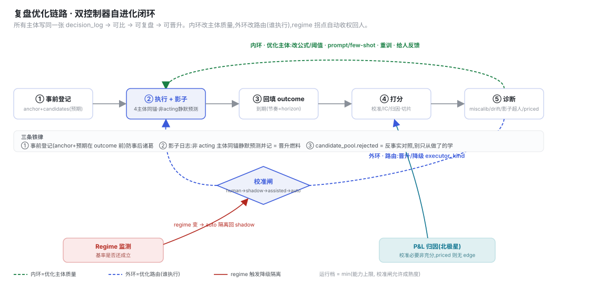
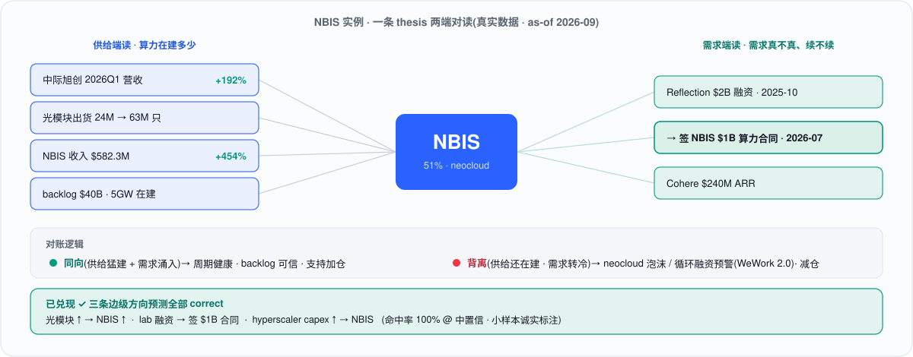
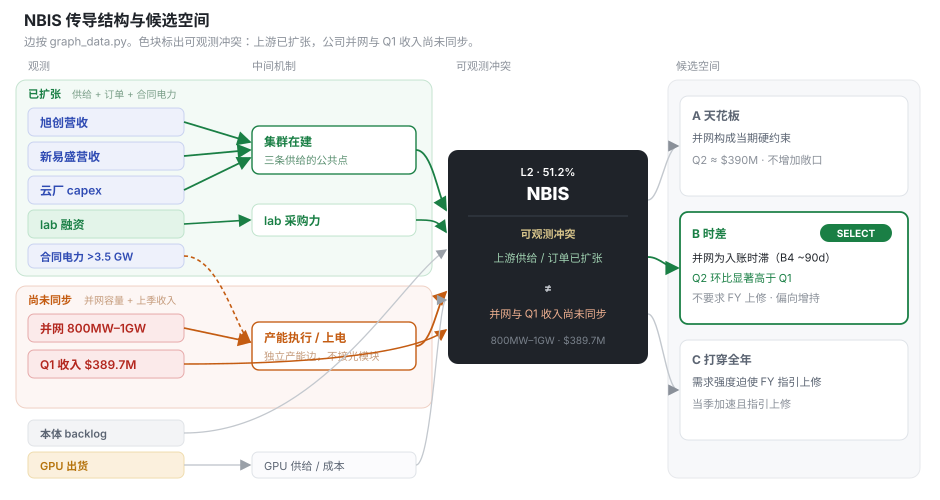
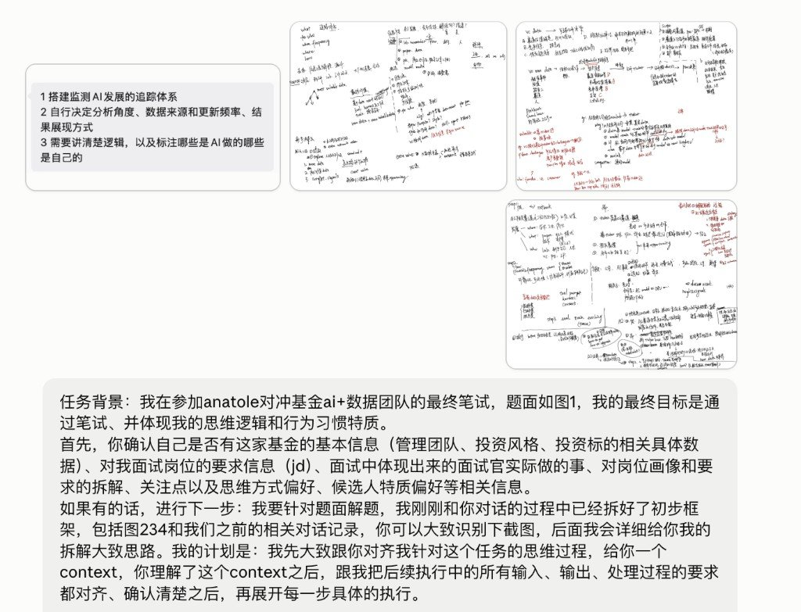
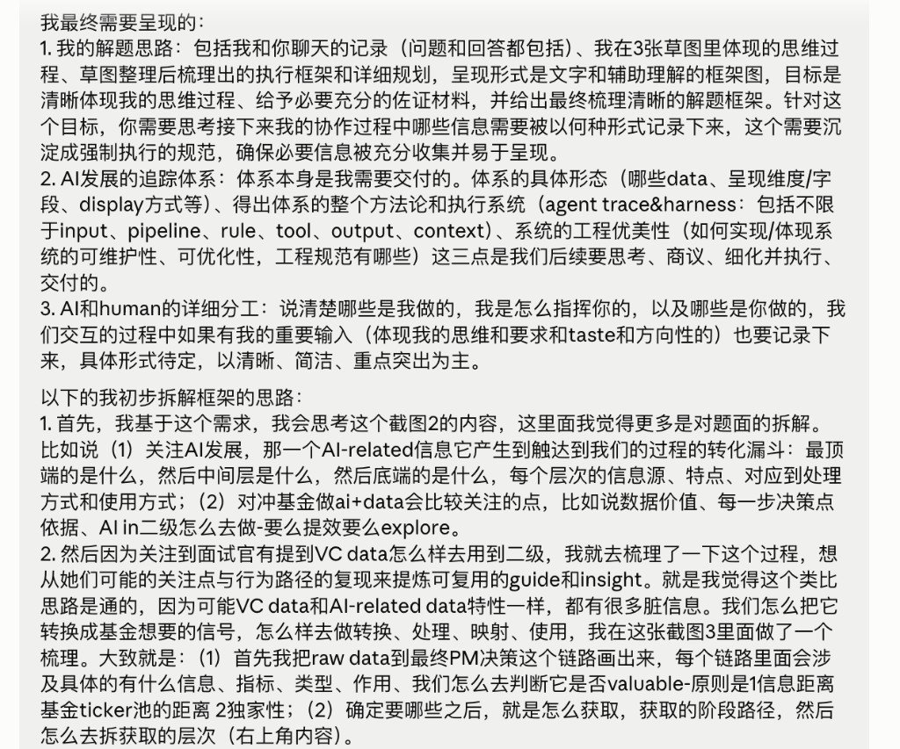
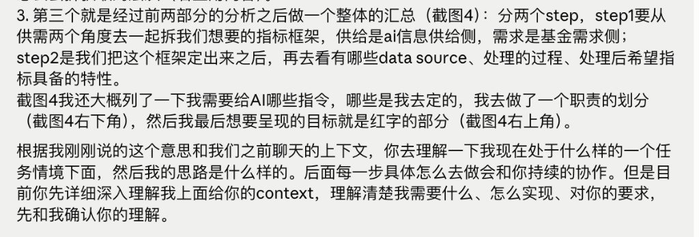
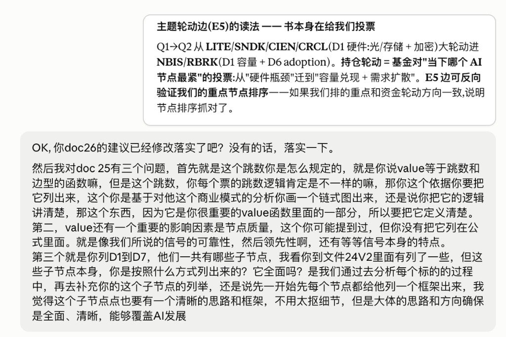
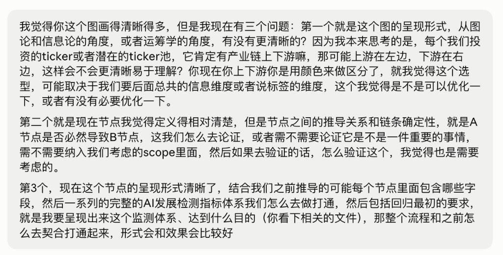
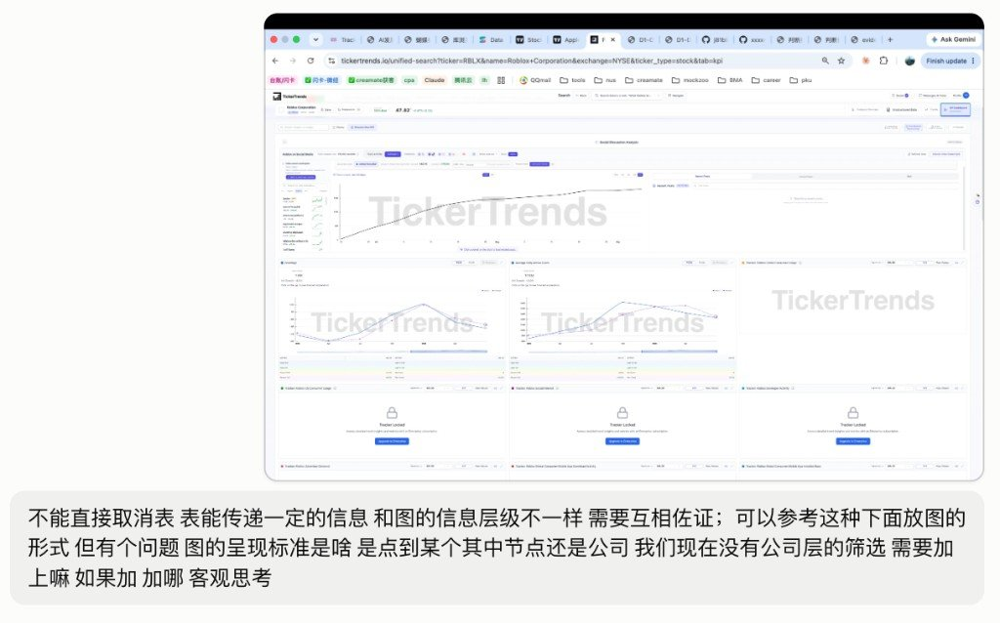
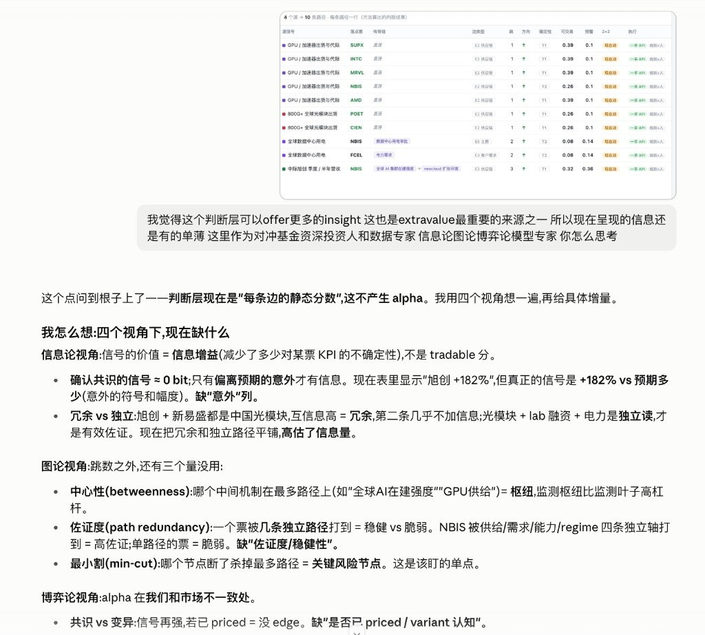

**图 · AI 发展监测体系总览**

 

 

<blockquote>

真正 proprietary 的东西也会从 prompt 向下移动：候选空间怎么构造，什么时候扩大和剪枝，state 保留什么，什么置信度可以自动执行，什么时候升级 frontier reasoning，failure 怎么 recovery，trajectory 如何进入下一轮 learning。这些今天看起来很“脏”的 Harness 工作，很可能逐渐构成一个 Agent 最重要的 intelligence architecture。

——孟醒 · <a href="https://mp.weixin.qq.com/s/m2NUWypKHN3Lv857aNVhSg">《JEV火了，但真正重要的不是JEV》</a>

</blockquote>

[阅读指南](#阅读指南) • [第一部分：破题](#i-破题与定位信息降维与需求锚定) • [第二部分：点边](#ii-点边表征intelligence-graph-计算循环) • [第三部分：落地](#iii-三层架构落地与工程体系) • [第四部分：示例](#iv-示例以-nbis-为例的全链路推演) • [第五部分：终局](#v-终局数据资产沉淀与未来迭代) • [附录：协作](#附录人机协作纪实)

---

## 阅读指南

1. **本页目录**
   1. [I. 破题与定位：信息降维与需求锚定](#i-破题与定位信息降维与需求锚定)
   2. [II. 点边表征：Intelligence Graph 计算循环](#ii-点边表征intelligence-graph-计算循环)
   3. [III. 三层架构：落地与工程体系](#iii-三层架构落地与工程体系)
   4. [IV. 示例：以 NBIS 为例的全链路推演](#iv-示例以-nbis-为例的全链路推演)
   5. [V. 终局：数据资产沉淀与未来迭代](#v-终局数据资产沉淀与未来迭代)
   6. [附录：人机协作纪实](#附录人机协作纪实)
2. **重要参考**
   - 决策顺序与人机分工：[docs/22](docs/22-解题思路与分工.md)
   - 数据源与处理链路：[docs/21](docs/21-数据来源与处理方法说明.md)
   - 分叉与取舍：[docs/23](docs/23-解题思路.md)
   - 决策视图：[日历式看板](assets/16-AI发展监测日历.html)
   - 工程复现：[pipeline/README.md](pipeline/README.md)

`docs/13`、`docs/process/`、`research/` 为过程稿，不作为入口。

---

## I. 破题与定位：信息降维与需求锚定

> **核心思路**：从基金 13F 持仓反向确定监测范围，沿产业链做信息降维，换取领先期（Lead Time）与 Nowcast。

“监测 AI 发展”是一个过于宽泛的命题。从对冲基金数据资产沉淀的视角出发，我们需要的是能够支持最终投资决策的因果链。破题先拆需求侧与 AI 侧，再对齐筛选观测信号：

*   **需求侧锚定 (Demand-anchored)**：必须从基金当前的 13F 真实持仓（如 NBIS、RBRK）及未来目标票池出发，反向逆推我们需要监测的 AI 节点。通过将“AI 供给”与“持仓需求”进行科学溯源的对接，系统过滤出了高信噪比的候选池。
*   **AI 侧信息降维 (Information Funnel)**：从 Science Lab 到创业公司再到上市公司，信息沿漏斗降维。漏斗标定三件事：**可靠性 / 确定性**（越往下越可对账）、**重要性梯度**（能否接到持仓）、**领先期**（越往上 Lead Time 越长）。在此之上，再按产业链拆为 **D1–D7**，便于观测对象的采集与管理。

**表 · AI 侧信息降维：成熟度层 × 产业链分维**

| 监测层 | 典型对象 | 信号形态 | 领先期 | 确定性 | D1–D7 采集分维 | 投研用法 |
| :--- | :--- | :--- | :--- | :--- | :--- | :--- |
| **Science Lab / 前沿** | 顶刊、实验室、开源与榜单 | Paper、模型卡、评测、技术博客 | 最长 | 最低 | **D5** 能力与算法前沿为主；旁及 **D2** 数据权属、弱 **D4** | 雷达与主题预置 |
| **创业 / 未上市** | Frontier lab、neocloud、供应链中游 | 融资、合同、排产、出货、政策文本 | 中长 | 中 | **D3** 资本；**D1** 中游供给；早期 **D6**；**D7** 政策冲击常先打这里 | 领先指标与路径候选 |
| **上市公司** | 持仓与可比公司 | 财报、股东信、电话会、8-K / 巨潮 | 最短 | 最高 | **D1** 产业确认；上市 **D6**；可对账 **D7**；持仓本体 KPI | 验证终点与披露回写 |

> **产业链七维**：D1 算力供给 · D2 数据供给 · D3 资本 · D4 人才 · D5 算法与能力前沿 · D6 商用落地 / token 经济 · D7 政策 · 能源 · 安全（投入 D1–D4，能力 D5，变现 D6，regime D7）。

*   **观测信号池 (Signal Set)**：需求侧与 AI 侧对齐后，进入池的信号按节点五因子与边传导打分（[`metric_factor`](pipeline/SCHEMA.md#tbl-metric_factor) / `v_edge_calc`）。
    *   **节点五因子**：可靠 r、独家 e、可观测 / 信噪 s、频率 φ、固有领先 l。
    *   **边传导**：传导确定性 c、领先期 τ。
    *   **打分**：节点固有价值 `valuable = w_e·e + w_s·s + w_r·r + w_φ·φ`；落到持仓边上再拆 **可交易度** `tradable = c·r·s·φ`（Nowcast / 排序）与 **预警度** `warning = τ·l·e`（watchlist）。
    *   系数登记为假设，只用于排序，不进 Sizing（[`assumption`](pipeline/SCHEMA.md#tbl-assumption)）。

---

## II. 点边表征：Intelligence Graph 计算循环

> **核心思路**：面对极度非结构化、频率错位的底层数据，系统将其压成点（指标）与边（传导），再接入 Intelligence Graph 的计算循环，将大模型的开放式生成收敛为可量化的分类与路由。

**1. 底层数据约束 (Data Constraints)**
在确定观测信号池后，系统针对真实底层数据的三大痛点建立了处理基建：
*   **非结构化极其严重**：建立强制降维规则，将形态各异的输入（Paper、宏观政策）压缩为标准化的事实表征。
*   **更新频率存在错位**：前沿突发事件与财报季度披露存在时差。系统必须具备跨周期对齐能力，通过计算“领先期（Lead Time）”抹平频率差。
*   **信噪比参差不齐**：建立严密的五级溯源体系（P1-P5）和八步处理 Pipeline。
*(注：受限于时间，本轮重点实证了 NBIS 等持仓，但针对整体大盘的收集规范与处理体系已全部落定，详见 [数据来源与处理方法说明](docs/21-数据来源与处理方法说明.md)。)*

**2. 指标节点与传导边 (Nodes & Edges)**
清洗后的数据只保留两类对象：
*   **点 (Nodes)**：AI 供给侧拆解为 7 个维度及前沿雷达。指标仅存定义，严格区分于事实本身。
*   **边 (Edges)**：边不仅代表关联，更具有方向、权重和脆弱性（如通过计算供应链“最小割”直接定位风险咽喉）；结合运筹学与信息论，量化信号的确定性衰减。每条边历经 T1(可回测)/T2(对账)/T3(定性) 三层验证（[`edge_registry` ↗](pipeline/SCHEMA.md#tbl-edge_registry)）。

**3. Intelligence Graph 计算循环**
> *灵感参考：孟醒[《JEV火了，但真正重要的不是JEV》](https://mp.weixin.qq.com/s/m2NUWypKHN3Lv857aNVhSg)——“统一接口（Token）不等于统一计算。能通过 Generation 表达的智能，不意味着都应该通过 Generation 计算。”*

为了进行投资判断，我们不需要大模型去“写一篇 3000 字的生成式研报”。在投研这种 Decision-native 的场景中，**扣动扳机是极低频的，但前期的信息筛选、验证、路由是极高频的。** 如果每一次微小的判断都启动自回归生成器，系统经济学将无法支撑。

因此，系统摒弃了单纯的 Prompt Engineering，转向 **Intelligence Orchestration（智能编排）**。我们将点边模型接入以下计算循环：
*   **REPRESENT (表征)**：这是耗时最长、最依赖 Harness 的一步。将外部非结构化长文，压缩成 Point-in-time 的标准化状态，提取出 Deterministic 的事实。
*   **PROPOSE (提出候选)**：当数据出现背离时，沿传导边展开，枚举出所有可能影响持仓的因果解释。
*   **PREDICT (预判)**：结合领先期评估该信号对未来 KPI 的影响幅度。
*   **SELECT (选择与剪枝)**：系统不再生成长文本，而是直接对有限的候选空间进行概率打分（Scoring），通过证伪与影响力双重闸门，剪枝剔除无效假设。

**图 · Intelligence Graph 计算循环**

---

## III. 三层架构：落地与工程体系

> **核心思路**：理论范式必须应对真实工程中的摩擦力。系统被切分为三层实体架构，以实现事实与假设的绝对解耦、AI 模型的可控管理（白盒化），以及向研究员直觉的高效折叠。

### 1. 数据层：事实与假设的解耦 (Data & Pipeline)
在投研中，最危险的是将主观预判当成客观事实。工程上必须做到物理隔离：
*   **绝对真实的底层**：底层只存储绝对干净的、遵循 P1-P5 溯源的事实记录（[`source_master` ↗](pipeline/SCHEMA.md#tbl-source_master)）。
*   **假设台账 (Assumptions Ledger)**：所有涉及主观预判的传导概率与权重系数，全部分离存入独立的“台账”（[`assumption` ↗](pipeline/SCHEMA.md#tbl-assumption)）。预测出现偏差只需调参，真实数据链绝不被污染。
*   **自动化入库**：严格分离指标定义与四类事实表，按 `采集 → 快照 → 抽取 → 路由 → 校验 → 迁移` 的 Pipeline 自动流转。

### 2. 治理层：执行路由与白盒化管理 (Governance)

**图 · 校准复盘双控制器闭环**

为了将 AI 从黑盒转变为可管理的系统组件，控制流被明确切分：
*   **三路执行路由**：确定性逻辑交给 **Code**（如关系映射、规则计算）；复杂的语义压缩交给 **LLM**；而最终的信号定档与方向复核，必须交由 **人工** 兜底。
*   **Agent Trace (设想与规划)**：未来的规划是全面接入 Langfuse。通过留存每一次 Prompt 与 Output 形成观测轨迹，并建立 Eval 机制对模型分类准确度持续打分，确保高精度数据资产沉淀。

### 3. 呈现层：决策视图重构 (Decision-Oriented Presentation)
底层执行着复杂的图计算，但系统的终端出口必须向研究员的投资直觉靠拢，屏蔽底层的技术复杂度。
*   **日历式主视图与影响卡 (Impact Card)**：抛弃给数据管理者看的复杂 Schema，极简为三个核心决策信息：事件本体描述（这是什么）、传导对象与权重（影响谁）、验证逻辑的时间点（下一步盯什么）。（👉 [点击查看 Demo](assets/16-AI发展监测日历.html)）

---

## IV. 示例：以 NBIS 为例的全链路推演

> **核心思路**：事实表征与因果假说解耦；披露前完成路径选择；披露后将结果回写为可回放的校准记录。沉淀的是判断轨迹，而非单次预测命中。

基于 2026 Q2 13F，**NBIS 权重约 51%**。决策窗口为 Q1 股东信日 **2026-05-13** 至 Q2 披露日 **2026-08-12**（91 天）。海关 HS8517 序列仍为 placeholder，未进入本轮推断。

**路径：** 观测状态（上游供给扩张、订单落地、并网与上季收入尚未同步）→ 候选空间 **{A 天花板 · B 时差 · C 打穿全年}** → SELECT 取 **B** → Q2 兑现：序列收入支持 B，全年指引不支持 C。

**图 · NBIS 供需对账**

### 4.1 REPRESENT · 事实表征（不含因果解释）

季报由 **Code** 解析，股东信与电话会由 **LLM** 抽取，统一写入 [`fct_quant`](pipeline/SCHEMA.md#tbl-fct_quant)。回测仅允许使用 `knowledge_time` 不晚于决策时点的记录。

**表 · REPRESENT 事实入账（Q2 披露前 as-of）**

| 传导链 | 事实（as-of Q2 披露前） | knowledge_time |
| :--- | :--- | :--- |
| **供给** | 旭创 Q1 营收 **195 亿元，YoY +192%**（`r320`）；新易盛 Q1 **83 亿元，YoY +106%**（`r328`） | 04-17 / 04-24 |
| **需求** | Reflection 融资 **$2B**，随后与 NBIS 签订算力合同 **$1B**（`r404` / `r406`）；OpenAI $122B、Anthropic $65B | 截至 07-14 |
| **公司** | 合同电力 **>3.5 GW**，年底指引 **>4 GW**；并网 / 可上架 **800 MW–1 GW**（已并网容量 ≠ 合同电力）；Q1 AI cloud **$389.7M**；FY 指引 **$3.0–3.4B** | 05-13 |

抽取职责止于字段映射：旭创一季报 → `r320` actual；Q1 股东信 “more than 4 GW” → `r255` guidance。海关月报保持 placeholder，不进入后续候选空间。

### 4.2 PROPOSE · 互斥候选空间

图结构为三条**并行传导链**，而非串行漏斗：供给侧汇聚于「集群在建」；需求侧经 lab 采购落地；并网属于公司产能执行边，不接入光模块供给。[`graph_data.py`](pipeline/graph_data.py)

**图 · NBIS 传导结构、可观测冲突与候选空间**

图中绿色 / 橙色对照即为该冲突。对「尚未同步」至少存在三种互斥解释，披露前均未被证伪：

**表 · PROPOSE 互斥候选 A / B / C**

| 候选 | 因果解释 | 对 Q2 的可证伪预测 | 头寸含义 |
| :--- | :--- | :--- | :--- |
| **A 天花板** | 并网容量构成当期硬约束 | 收入仍接近 Q1 **$390M** | 不增加敞口，等待并网数据 |
| **B 时差** | 并网滞后于合同电力；按假设 B4（产能领先收入约 90 天）计入 Q2 | **环比显著高于 Q1**；不要求 FY 指引上修 | 偏向增持 |
| **C 打穿全年** | 需求强度足以迫使 FY **$3.0–3.4B** 上修 | 当季加速 **且** 全年指引上修 | 提高进攻性敞口 |

打分函数 `c·r·s·φ` / `τ·l·e` 仅用于候选排序；系数仍为先验假设，**不进入 Sizing**（[`assumption`](pipeline/SCHEMA.md#tbl-assumption)）。

### 4.3 SELECT · 披露前路径选择

窗口截止 **2026-08-12 开盘前**。选择 **B**：合同电力已 **>3.5 GW**、Reflection 合同 **$1B** 已落到 NBIS、Q1 已披露 exceeded expectations，更符合入账时滞，而非产能硬约束。排除 A（将时滞误判为约束）；排除 C（全年指引已内含后半程加速，上修构成独立跳跃）。

### 4.4 闭环 · 披露后回写与校准

**表 · 披露后兑现与路径标签**

| 口径 | B 的事前预测 | Q2 实现 | 标签 |
| :--- | :--- | :--- | :--- |
| AI cloud | 环比显著高于 $389.7M | **$575M**（QoQ **+47.6%**） | **B 成立** |
| 集团 | 同上 | **$582.3M**（QoQ **+46.0%**） | **B 成立** |
| ARR | 随产能确认上移 | $1.92B → **$3.0B** | 与 B 同向 |
| FY 指引 | B **不要求**上修 | 仍 **$3.0–3.4B** | **C 不成立**；B 的覆盖范围限于序列收入 |

**误差归因**（按 outcome 落点分层）：

**表 · 选错改哪一层**

| 情形 | 修正层 | 本例 |
| :--- | :--- | :--- |
| 候选已在池内、路径选错 | **SELECT**：`decision_log` 记 wrong，同类状态下对该路径降权 | 若选 A：并网偏低并不蕴含当季收入无法兑现；A 保留在下一期候选池 |
| 事后成立的解释当时未枚举 | **PROPOSE**：补入 `candidate_pool` | 本例未发生 |
| 字段抽取错误 | **REPRESENT** | 本例未发生 |
| 将 B 的成立自动晋升为 C | 禁止；C 保持独立跳跃 | FY 指引未动，C 记不成立 |

**迭代路径（规划）：**
1. **轨迹**：每次 SELECT 记一条 Agent rollout。observation = `state_anchor`（当时可知的 record_id 与 as-of）；action space = {A,B,C}；action = 选中路径；delayed reward = 披露后的 correct / wrong / mixed。
2. **评测**：离线看校准（置信度是否等于命中率）与候选召回（事后成立的路径当时是否在池内）。
3. **训练**：SELECT 训成离散动作上的 policy head，输出 P(路径 | 状态)；REPRESENT 的抽取轨迹接入 Langfuse，以 span-level eval 迭代抽取器。

工程底座：[`checks.py`](pipeline/checks.py) 拦截未验证假设进入 Sizing；`change_log` 按 as-of 重放当时可见记录；`v_health` 监测信源时效。

## V. 终局：数据资产沉淀与未来迭代

> **核心思路**：真正的护城河不是单次的个股预测，而是系统自身的运行纪律。基于对当前系统断点的诊断，把这套单票验证工具迭代为可横向复制的数据资产。

### 5.1 当前系统的断点与缺陷诊断
1. **回测深度不足，系数仍为假设**：目前的周频/季频数据多为近期的点状快照，缺乏历史时间序列。这导致“点边模型”中的权重和传导系数，绝大多数仍是停留在“假设台账”里的主观先验，无法达到 T1 级别的量化验证。
2. **缺乏自动化调度与排队机制**：虽然架构规划了 Code/LLM/人工的分工，但由于没有引入调度器，数据的采集、抽取和入库尚未形成真正的自动化流转。
3. **LLM 结果缺乏闭环监控**：目前的判断层多为 AI 初稿，但对 LLM 提取的准度缺乏系统的评估（Eval）和反馈循环。

### 5.2 下一步的迭代路径与资源需求
针对上述断点，下一步的演进路径及所需资源如下：
1. **数据纵深回填与系数标定**
   *   **行动**：向历史回溯，补齐过去数个财季与周期的底层数据。
   *   **资源与工具**：需要额外的历史研报、行业数据库授权（如海关历史明细），以及用于大批量回测标定的算力资源。有了历史序列，我们才能将主观假设替换为统计显著的客观系数。
2. **打通自动化调度与 Eval 闭环**
   *   **行动**：引入工作流调度器（如 Airflow 或 Prefect），实现数据管道的定时、自动流转。同时，真实落地 Langfuse，收集 LLM 犯的错形成专属数据集，优化分类与抽取的准确度。
   *   **资源与工具**：需要云端的编排工具基建，以及早期需要更多的人力介入复核，以完成初期 Eval 数据集的标注。
3. **横向扩展：从单票样板到全域资产**
   *   **行动**：在上述基础设施（数据深度、调度、监控）跑稳的前提下，将 NBIS 的迁移脚本与处理逻辑复制到其他通用 AI 标的与未来目标票池中。
   *   **目标**：将这套被验证过的生产线，以极低的边际成本横向复制，最终实现从“验证当前持仓”向“自动推演并发现未来投资机会”的系统升级。

---

## 附录：人机协作纪实

> **协作方式**：人定问题边界、取舍标准与验收口径；AI 负责展开、落库与起草。先对齐上下文再动手，关键分叉由人拍板，过程中持续纠偏。以下为不同环节的原始截图，按时间顺序排列。

### 1. 破题启动：手写框架 + 对齐上下文

题面拆解、手写推演，以及开场时要求 AI 先确认基金与任务背景，再按手稿框架推进。

**图 · 破题启动：手写框架与对齐上下文**

### 2. 交付物与拆解口径

明确最终要呈现的三块：解题思路（含聊天与手稿）、追踪体系本身、人机分工；并给出供给侧漏斗与需求侧锚定的初步拆法。

**图 · 交付物与拆解口径**

### 3. 动手前再确认理解

供需两侧框定后，先让 AI 复述任务语境与分工，确认对齐再进入逐步执行。

**图 · 动手前确认理解**

### 4. 建模纠偏：跳数、节点质量、D1–D7

对 AI 产出追问价值函数里 hops 的定义、节点质量是否写入公式、七维子节点是自下而上还是先有完备框架。

**图 · 建模纠偏：跳数、节点质量、D1–D7**

### 5. 图结构：呈现、边确定性、体系打通

从图论 / 信息论 / 运筹角度讨论布局；节点清楚之后，追问边的论证是否纳入 scope，以及如何回接到监测体系目标。

**图 · 图结构：呈现、边确定性与体系打通**

### 6. 呈现层：表与图互相佐证

参考外部看板形态，要求表不能取消；并客观讨论是否需要公司层筛选、图的触发粒度落在节点还是公司。

**图 · 呈现层：表与图互相佐证**

### 7. 收敛原则：列是浅层信息

停止堆列；重心放到处理思路、判断层 insight，以及数据 / 文字 / 图表的最优呈现形式。

**图 · 收敛原则：列是浅层信息**

### 8. 判断层加厚：信息论 · 图论 · 博弈

在路径打分表之上，要求从信息增益、中心性 / 最小割、共识 vs 异见等角度补 insight，而不是再加静态分数列。

**图 · 判断层加厚：信息论 · 图论 · 博弈**

