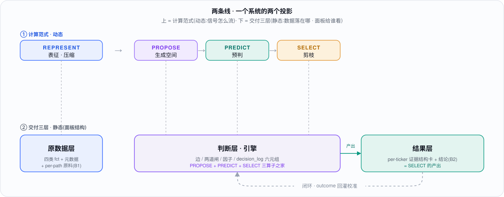

<div align="center">


<br/>


</div>

> 面向成长股基金(港股 / 美股)的 **AI 发展监测体系**:把一条 AI 前沿动态压成可计算的表征,沿因果链传导,导向具体持仓 ticker 与可观测 KPI——全程可信、可溯、可纠、可校准。
>
> 它不是"一个会写研报的 AI",而是一张**自我校准的 Intelligence Graph**。

## 目录

- [设计出发点 · 为什么是一张 Intelligence Graph](#design)
- [这套映射是怎么长出来的 · 从供需对接到因果图](#build)
- [四算子 ↔ 现有 schema(点落点看字段结构)](#operators)
- [两条线 · 从计算范式到面板结构](#bridge)
- [交付三层 · 原数据层 → 判断层 → 结果层](#judgment)
- [目录结构](#layout)
- [如何运行](#run)
- [数据模型(五层)](#datamodel)
- [方法与分工](#roles)
- [数据说明](#datanote)

---

<a id="design"></a>

## 设计出发点 · 为什么是一张 Intelligence Graph

<div align="center">

</div>

这套体系的出发点,是一个关于**计算范式**的判断:

> **能用 Generation 表达的智能,不一定应该用 Generation 计算。**

有时候我们需要的不是更多的**生成**,而是把复杂、多源、口径不一的信息,**以合适的形式压缩到一个 pattern 表征**里(REPRESENT),在此之上枚举候选、做预测(PREDICT),再高频地**剪枝、选择**(SELECT),通过这样一个范式**验证一个又一个决策节点**——最终形成的,是一条推理链条,以及塑造整条「表征 → 预测 → 剪枝 → 选择 → 迭代」链路的**权重**。

投研恰好是最典型的 **decision-native**(而非 generation-native)工作负载:每个节点的输入 state 很复杂(多源证据、可信度、口径是否可比),输出却是**有限候选上的一个选择 + 一个置信度**。所以结论不是"我们要用某个模型",而是——**基金的投资体系本身应该按这个计算范式来设计**:重决策、压缩、预测、剪枝;生成只在图的**边缘**出现(写简报、向人解释、提出新的解释候选)。

- **候选空间是被设计出来的,不是天生的**:常规投研里,"AI 发展 → ticker"的分析(按供应链、按竞对……)本质上就是在一个人工枚举的候选空间里工作。把它显式化成一张图,这个空间才可以**扩张、细化、校准**——甚至整个基金的投资体系都可以采用这种形式。
- **compute 的执行者不必是通用大模型**:它可以是 *for-representation / for-prediction / for-selection* 的专用**小模型**。schema 只声明每个决策点的 **typed I/O 契约**,执行者(人 / 通用 LLM / 专用模型 / 规则代码)是**可替换件**。
- 押注的是 **Computation Specialization,而非 Model Specialization**。所以**今天的每一行数据,同时是明天专用模型的 I/O 契约与训练集**——这就是"**为后来的 AI 基建做设计**"的具体含义。

> 这套计算范式的判断,**启发自孟醒的文章 [《JEV 火了，但真正重要的不是 JEV》](https://mp.weixin.qq.com/s/m2NUWypKHN3Lv857aNVhSg)**(公众号「孟醒的笔记本」)。我读后的设计立场——四算子如何落到本体系的 schema——见 [`pipeline/JEV-intelligence-graph.md`](pipeline/JEV-intelligence-graph.md)(文章原文存档 [`pipeline/JEV`](pipeline/JEV))。

---

<a id="build"></a>

## 这套映射是怎么长出来的 · 从供需对接到因果图

<div align="center">

</div>

要让"AI 发展 → ticker"的朴素逻辑(供应链、竞对……)能扩张、能校准,就得把它一步步搭成一张真正的图。这套「AI 发展 → 基金 ticker」映射的真实构建路径如下(每步都是整理后的面试版,过程稿在 `docs/process/`;每步末标注了当时的"为什么 · 思路 · 目标"):

| 步 | 做了什么 | 过程原稿 / 落点 |
|---|---|---|
| ① 供给侧建模 | 把 AI 发展拆成 **D1–D7 七维节点**(算力 / 数据 / 资本 / 人才 / 能力前沿 / 商用 / 政策·能源),每维一条"拆解主轴"保证查全 | [供给侧全景](docs/process/01-供给侧建模.md) |
| ② 指标体系 | 数据类型四分类(量价 / 事件 / 观点 / 前沿)+ 通用元数据层 + 字段规范 | [指标体系](docs/process/02-指标体系.md) |
| ③ **供需对接** | 把 AI 节点 × 持仓 ticker 连成一张有向图(即上图 bowtie)+ 一条 thesis 两端对读 | [供需对接](docs/process/03-供需对接.md) |
| ④ schema 设计 | 把前几步的产物落成可计算、可追踪的表:**节点**(① 的 D1–D7)→ 指标真源 R、**边**(③ 的传导关系)→ 边真源 E、**事实**(② 的四类观测)→ 四类事实表 `fct_*`、**判断**(分析师的分级 / 方向 / 定 tier,前面没出现的新增层)→ 判断表(决策层)。核心纪律:原子事实 vs 可推导、判断与数据分表 | [schema 设计](docs/process/04-schema设计.md) · [`schema.sql`](pipeline/schema.sql) |
| ⑤ **点 · 边 · 权重(映射范式)** | 逐票向上游反推 · 六类边 E1–E6 · 跳数 · **映射价值 = 传导确定性 × 节点质量** · 边确定性三层验证 T1/T2/T3 → `edge_registry` | [点·边·权重(整理稿)](docs/process/05-映射范式-点边权重.md) · [`edge_registry` 字段 ↗](pipeline/SCHEMA.md#tbl-edge_registry) |
| ⑥ 实例验证 | NBIS 七条链(光互连 / 在建强度 / 上电 / lab 融资 / 能力→推理 / 政策审批 / 出口管制)逐链核对,真实数据走一遍 | [NBIS 实例(整理稿 · 真数 + 已兑现)](docs/process/06-NBIS实例.md) |

### 整条流程,一段话读懂

① 先把 **AI 发展**本身铺成一张**供给侧全景**(七维节点池)→ ② 定义**怎么测**这些节点(数据按结构分四类:量价 / 事件 / 观点 / 前沿,每条带元数据)→ ③ 把 AI 节点**连到持仓票**(有向图,并用"一条 thesis 两端对读"做交叉验证)→ ④ 把节点 / 边 / 事实 / 判断**落成有纪律的表**(schema)→ ⑤ 给每条边**打分排序**(跳数 × 节点质量 → 可交易度 / 预警度,并按 T1/T2/T3 定确定性)→ ⑥ 用 **NBIS 真数跑一遍**验证,到期用真值给预测打分。

**这套体系的目标——从基金数据负责人与合伙人的角度——不是"监测 AI 新闻",而是把 AI 发展变成一项会复利的决策 edge**:对**数据负责人**,是一条可信、可溯、可纠、置信度诚实的数据 → 结论管线,坏数据进不来、每条结论都站得住;对**合伙人**,是更早、带证据、卖方不做的差异化读数(如供给 ⟷ 需求对账抓 neocloud 泡沫),且**每一次判断都在为自动化攒校准与训练数据**。它最终是一张**租不到的 intelligence graph**——模型谁都能租,这张图与它的权重(R + E + 判断 + 校准曲线)租不到;北极星是 **P&L 归因**。

**⑥ 一张图看 NBIS 怎么跑通**——**AI 发展节点(D1–D7)**经**六类边**(带跳数 · cert_tier)按**权重**(可交易 / 预警 / 方向)传导到 NBIS;方向与 tier 是可校准的**分析师判断**。再用供给 ⟷ 需求两端对账,三条预测已兑现:

<div align="center">

</div>

**关键概念速览**:

| 概念 | 是什么 | 产生于 |
|---|---|---|
| **节点** | AI 发展的七维 D1–D7(算力 / 数据 / 资本 / 人才 / 能力前沿 / 商用 / 政策·能源) | ① |
| **事实(四类)** | 观测按结构分四类(量价 / 事件 / 观点 / 前沿)→ 四张 `fct_*` 表 | ② |
| **边(六类 E1–E6)** | AI 节点怎么传到票:本体 / 供应链 / 需求 / 竞对 / 主题 / 资金人才 | ③⑤ |
| **跳数** | 从票的核心因子沿链反推到 AI 节点,跨过几个因果箭头(越多越领先、越不确定) | ⑤ |
| **判断** | 分析师对信号的分级 / 方向 / 定 tier——与数据分表,进决策层 | ④ |
| **真源 R / E** | 指标唯一真源 `metric_registry` · 边唯一真源 `edge_registry`;改指标只动 R、改边只动 E | ④ |
| **cert_tier T1/T2/T3** | 边的确定性:可回测 / 结构对账 / 只给方向 | ⑤ |
| **可交易度 / 预警度** | 映射价值函数的两个产出:决定"下多少注" / 给"方向·预警不下注" | ⑤ |
| **供给读 ⟷ 需求读** | 一条 thesis 两端交叉验证:同向健康、背离 = neocloud 泡沫预警 | ③⑥ |

**正是这套具体逻辑,才被抽象成四算子 Intelligence Graph**:供需对接 = REPRESENT + PROPOSE 的雏形,点-边-权重打分 = SELECT,逐票向上游反推 = 在候选空间里剪枝。下一节是它到 schema 的正式对应。

---

<a id="operators"></a>

## 四算子 ↔ 现有 schema(点落点看字段结构)

> 这一节是**数据的 extra value 落点**:四算子不是概念,每一步都落到真实的表/视图,带真实规模。「落点」里带 ↗ 的表名可点击,跳到 [`pipeline/SCHEMA.md`](pipeline/SCHEMA.md) 看**字段结构**。**成熟度**如实标"运行中 / 骨架就绪"——诚实标注小样本本身,是数据治理的第一考核。

| 算子 | 在本体系的落点(真实规模 · ↗ 看字段) | 成熟度 |
|---|---|---|
| **REPRESENT** 压缩表征 | [`stg_observation`↗](pipeline/SCHEMA.md#tbl-stg_observation) **317 条**单口接入 → `route()` 确定性分五类 fct([`quant`↗](pipeline/SCHEMA.md#tbl-fct_quant) 179 / event 92 / frontier 23 / opinion 8 / position 15,**零漏路由**,checks 7b 守)· 通用元数据层 **100% 填满**:knowledge_time as-of(月→15、年/季→NULL **不伪造精度**)· provenance P1–P5(P1 占 259)· snapshot_id→**101 个真快照文件**· anchor 存原文短引 · `superseded_by` **32 条修订链**旧值不删 · [`source_master`↗](pipeline/SCHEMA.md#tbl-source_master) 176 源分级 · schema_doc **402 列**全字典 | 🟢 运行中 |
| **PROPOSE** 枚举候选 | [`edge_registry`↗](pipeline/SCHEMA.md#tbl-edge_registry) **36 边** = 候选解释词表(E1 2 / E2 12 / E3 14 / E4 2 / E5 5 / E6 1;28 节点 → 11 票;hops 0–3 带 `map_path` 显式中间机制 + `evidence_ids` JSON 溯源;cert_tier T1/T2/T3)· [`candidate_pool`↗](pipeline/SCHEMA.md#tbl-candidate_pool) **10 候选**(背离触发,超期报欠账 checks 7n)· [假设台账↗](pipeline/SCHEMA.md#tbl-assumption) 42 | 🟢 运行中(剪枝样本少) |
| **PREDICT** 指标预判 | [`metric_registry`↗](pipeline/SCHEMA.md#tbl-metric_registry)`.lead_time_est`(海关 20d / 光模块 18d / 上电 90d / lab 融资 180–278d,先验挂假设台账)· expectation_base **25 指标 Forecast** · [日历排期↗](pipeline/SCHEMA.md#tbl-calendar) 58 · `warning = τ·l·e` → `v_edge_calc` 36 边 · `d_edge_predict` **3 条带日期方向预测已兑现** | 🟡 部分(量级待回测) |
| **SELECT** 剪枝选择 | `route()`(唯一 auto 算子)· [`observation_direction`↗](pipeline/SCHEMA.md#tbl-observation_direction) **317 方向** · **两道级联闸**(证伪 → 影响力,decision_log impact 42 / falsify 9 留痕)· [`metric_factor`↗](pipeline/SCHEMA.md#tbl-metric_factor) **84 节点** × r/e/l/s/φ → 闭式打分 `tradable=c·r·s·φ` / `warning=τ·l·e` · 系数外置挂假设台账(**未 validated 故只排序、禁 sizing**) | 🟢 运行中 |
| **闭环** 自我校准 | [`decision_log`↗](pipeline/SCHEMA.md#tbl-decision_log) **95 条六元组**(state_anchor 可回放)· [`decision_registry`↗](pipeline/SCHEMA.md#tbl-decision_registry) 12 类判断的 I/O 契约 + `calib_status` 状态机 · `v_calibration` **首点**(d_edge_predict conf 0.6 · 命中 3/3 · calib_error 0.4) | ⚪ 骨架就绪(outcome 3/95) |
| **分工即 routing policy** | owner A/B/C/D 印在 ~12 张表(observation_direction 317 · change_log 3226)· `executor_kind`{rule 3 / human 9}· `calib_status`{**auto** 1 / **assisted** 2 / **human** 9}· checks 7l 校准闸(未 validated 禁 assisted/auto) | 🟡 人力版运行 · 模型段待接 |

### 为什么这是"租不到"的资产 · 对标竞品

大家都有数据 / nowcast / 血缘,**没人有一张会自我校准、逐事实 point-in-time 诚实的 AI → ticker 类型化因果图**。逐格看差异化落在哪一格:

| 你租得到 | 它给你 | 这张图多给的一格 |
|---|---|---|
| TickerTrends / M Science(alt-data nowcast) | 逐 KPI 的 Bogey / Consensus / Δ% / MOE | KPI 有了,但**没有"传导来路"**——这里给每条 KPI 挂上 AI 节点 → 六类边 → 票的因果链 |
| Daloopa / Visible Alpha(数据血缘) | 逐格 provenance 到 filing | provenance 有了,但**不做因果、不做预判**——这里带 lead_time + 方向 + cert_tier |
| DataHub / dbt / OpenLineage(治理) | 数据血缘 impact analysis | 血缘有了,但**机械、无置信度**——这里每条边带 T1/T2/T3 验证档 + confidence |
| State of AI / Epoch / AI Index(AI 追踪) | AI 发展数据 + 带日期预测记分卡 | 数据/预测有了,但**不落到票、无逐事实 provenance**——这里 confidence→outcome→校准,每条事实 P1–P5 可追 |

**四件的组合(逐事实 point-in-time 诚实 + 类型化因果边 + 带置信度的验证档 + confidence→outcome 自校准)就是租不到的那一格**:模型谁都能租,这张图与它的权重(R + E + 判断 + 校准曲线)租不到。

### 诚实成熟度标尺(现在跑通了什么 vs 待兑现)

按体系**自设的证伪标准**(见 [`JEV-intelligence-graph`](pipeline/JEV-intelligence-graph.md) §五):

- 🟢 **已运行**:接入→路由→四类 fct(317 条零漏)· 逐事实 provenance + 32 条修订谱系 · 六类边 + 闭式打分 · 判断六元组账(95 条)· 人力版 A/B/C/D cascade · 边级预测 3 条真兑现(旭创 +182% ⟷ NBIS +514% 等)。
- 🟡 **骨架就绪、待数据兑现**:outcome 回填 3/95 · v_calibration 仅 1 桶 n=3 · 边 cert_tier 回测 1/36 · 模型执行者(llm/model)0 条、**从未跨 human→shadow**。
- ⛔ **按纪律暂关**:系数未 validated → 全套分数**只排序、禁 sizing 与告警**;realized P&L 需行情源,暂留位(库内无价格序列,**不编价**)。

**这是一座地基扎实、正在施工的护城河,不是已兑现的 alpha**——它的价值在于:每条人工判断以≈0 边际成本沉淀成校准 / 训练集(`decision_registry` 每行 = 未来一个专用小模型的 I/O 契约),**数据的复利从第一天开始**。

### 判断经济学与兑现(JEV §五 · 真数,非实盘 P&L)

健康度从"填了多少行"转向**判断经济学**——下面前四行**不需要任何行情数据**,全部由 [`decision_log`↗](pipeline/SCHEMA.md#tbl-decision_log) / `v_decision_health` / `v_calibration` 直接派生:

| 指标 | 值(真库核验) | 要外部数据? |
|---|---|---|
| 判断吞吐 | **95 决策**(impact_gate 42 · factor 30 · falsify 9 · edge_tier 6 · edge_predict 3 · …) | 否 |
| 执行者分布(cost 代理) | **human 60% / rule 40% / llm·model 0%**(cascade 模型段待接) | 否 |
| 升级率 escalation | **0%**(0 / 95) | 否 |
| 校准误差 calibration error | **0.4**(d_edge_predict conf 0.6 · 命中 3/3 · 现 1 桶 n=3) | 否 |
| **方向兑现** | **3 / 3 命中**;兑现量级(**真实公开基本面**):旭创 +182% · NBIS +454% / Reflection $2B→$1B 合同 / hyperscaler capex ≈$165B | 公开基本面(真) |
| realized P&L | **待接行情源**——方法学已定(方向命中 × 区间标的收益 → 纸面,接实盘换 realized);库内无价格序列,**不编价** | 需行情 / 实盘 |

**诚实边界**:前四行是真过程指标(现在就有);方向兑现用的是**真实公开基本面**,不是价格收益;realized P&L 需要行情源——没有就留位,**不拿假价格凑一条 P&L**。这本身就是数据负责人的第一考核。

---

<a id="bridge"></a>

## 两条线 · 从计算范式到面板结构

上面讲的是**计算范式**(四算子,信号怎么流);面板则按**交付三层**组织(数据落在哪、给谁看)。两者不是两套东西,是**同一个系统的两个投影**:

<div align="center">

</div>

| 计算范式(动态:计算怎么流) | 落到交付层(静态:数据落在哪 · 给谁看) |
|---|---|
| REPRESENT 表征压缩 | → **原数据层**(四类 fct + 元数据 + per-path 原料 B1) |
| PROPOSE 生成空间 + PREDICT 预判 + SELECT 剪枝 | → **判断层 · 引擎**(边 / 两道闸 / 因子 / `decision_log` 六元组) |
| SELECT 的产出 | → **结果层**(per-ticker 证据结构卡 + 结论 B2) |
| 闭环校准 | → 把结果层的 outcome **回灌判断层**(反馈环,不是第四层) |

**一句话:四算子讲"计算怎么流",三层讲"数据落在哪、面板怎么给人看";判断层就是 PROPOSE / PREDICT / SELECT 三算子的家,闭环把结果绕回来校准。** 下面按这三层展开面板。

---

<a id="judgment"></a>

## 交付三层 · 原数据层 → 判断层 → 结果层(面板结构)

面板按上表的三层组织。**原数据层**是压缩好的事实(四类 fct + 元数据 + per-path 原料表 B1,即 [四算子 §REPRESENT](#operators) 的产出);下面重点展开 extra value 集中的**判断层**(把边聚合成对每只票的判断)与**结果层**(每票一张证据结构卡)。

四算子跑完得到一堆边(per-path);**判断层**把它们**聚合成对每只票的结论**,并给每种洞见**天然的呈现形式**——不是越加越宽的表(列是浅层信息)。详见 [`docs/19-判断层设计`](docs/19-判断层设计.md) 与 [`docs/20-执行路由与校准闭环`](docs/20-执行路由与校准闭环.md)。

**稳健性与风险是同一张图**:源→机制→票,佐证度 = 节点不相交路径数 = 最小割(门格尔定理),割点 = 关键风险单点。NBIS 6 条独立通道宽,但主线汇于 neocloud 上电;RBRK 版权 + 监管共用治理预算节点、实为 2 条通道 = 脆弱(独立性按共享节点算,不是按维度数)。


**两轴导航**:顶部公司轴(锚每票综合卡 / 扇入)+ 左栏 D1–D7 源轴(锚跨公司扇出 / 原料);机制节点只作图内下钻。表与图信息层级不同,互相佐证,缺一不可。


**自进化闭环**:谁做判断(code / llm / model / human)= f(可形式化, 语义, 奈特不确定, 基率, 频率×价值),`运行档 = min(能力上限, 校准闸允许成熟度)`。双控制器——内环优化主体质量,外环按**影子成绩**沿 human→shadow→assisted→auto 升降路由;regime 变则 auto 隔离回人。北极星 = P&L 归因。


---

<a id="layout"></a>

## 目录结构

```
AI-Monitor-Fund/
├── README.md                本文件
├── pipeline/                工程核心:真值源库 + 代码 + 迁移 + 视图 + 校验
│   ├── anatole_ai_monitor.duckdb   真值源(29 张表 + 视图)
│   ├── schema.sql · views.sql      表结构 / 可推导视图
│   ├── init_db.py · migrate.py · checks.py   建库 / 改库 / 校验
│   ├── core.py · db_read.py · directions.py · factors.py · entities.py · metadata.py
│   ├── migrations/                 0000_bootstrap → 00NN,一次改库 = 一个脚本
│   ├── snapshots/                  来源原文本地快照(证据,snapshot_id = 文件名)
│   ├── build_dashboard2.py · build_panel.py · gen_browser.py · gen_schema_doc.py
│   ├── PIPELINE.md · SCHEMA.md · README.md    运行机制 / 字段字典 / 数据岗手册
│   └── JEV-intelligence-graph.md · PANEL-DESIGN.md · UI-SPEC.md · …   方法与设计文档
├── data/
│   ├── tables/              7 张建库底稿 CSV(建库后冻结,改数走 migrations)
│   └── Anatole_13F_2023Q2-2026Q2_1.xlsx   持仓 13F
├── docs/                    顶层方法 / 协作日志 / 信息架构文档
├── research/                研究过程:AI 侧 · 指标侧 · 供需结合 · schema 演进 · 映射 · NBIS 实例 · 假设
├── submission/             题目 · 二面记录 · 合伙人背景与岗位画像
└── assets/                  独立 HTML 产出(监测日历 · schema 浏览器)· readme 图形
```

---

<a id="run"></a>

## 如何运行

**环境**:Python 3 + DuckDB。

```bash
pip install duckdb
```

**应用改库并校验**(日常):

```bash
cd pipeline
python3 migrate.py          # 应用 migrations/ 里未应用的脚本,刷新视图
python3 checks.py           # 业务规则校验:ERROR 必须为 0,WARN 逐条看
```

**从零复现真值源**(bootstrap + 重放全部改库脚本,结果与增量应用一致):

```bash
cd pipeline
python3 init_db.py --force  # 从 ../data/tables/ 的底稿 CSV 建库
python3 migrate.py          # 重放 0001…00NN
python3 checks.py           # 应得 ERROR 0
```

**生成产出**:

```bash
cd pipeline
python3 gen_schema_doc.py   # 库 → SCHEMA.md(每列有值率 + 每表锚点)
python3 gen_browser.py      # 库 → schema_browser.html(按思路 / 按数据层双视图)
python3 build_dashboard2.py # 库 → panel_v2.html(数据管理者面板)
```

**在副本上测试**(不动真值源):设 `ANATOLE_DB` 指向库副本,`ANATOLE_MIGRATIONS` 指向私有迁移目录。

---

<a id="datamodel"></a>

## 数据模型(五层)

| 层 | 表 / 视图(带 ↗ 的可点击看字段结构) |
|---|---|
| 接入 | [`stg_observation`↗](pipeline/SCHEMA.md#tbl-stg_observation)(一行一个事实,人 / agent 的登记格式) |
| 资产 | [`entity_master`↗](pipeline/SCHEMA.md#tbl-entity_master) · [`metric_registry`↗](pipeline/SCHEMA.md#tbl-metric_registry)(R,指标定义)· [`edge_registry`↗](pipeline/SCHEMA.md#tbl-edge_registry)(E,六类边 × 跳数 × T1–T3)· 四类事实 [`fct_quant`↗](pipeline/SCHEMA.md#tbl-fct_quant) / [`fct_event`↗](pipeline/SCHEMA.md#tbl-fct_event) / [`fct_opinion`↗](pipeline/SCHEMA.md#tbl-fct_opinion) / [`fct_frontier`↗](pipeline/SCHEMA.md#tbl-fct_frontier) · [`source_master`↗](pipeline/SCHEMA.md#tbl-source_master) |
| 治理 | [`assumption`↗](pipeline/SCHEMA.md#tbl-assumption) · [`coefficient`↗](pipeline/SCHEMA.md#tbl-coefficient) · [`metric_factor`↗](pipeline/SCHEMA.md#tbl-metric_factor)(r/e/l/s/φ)· [`observation_direction`↗](pipeline/SCHEMA.md#tbl-observation_direction) · [`key_fact`↗](pipeline/SCHEMA.md#tbl-key_fact) |
| 治理·决策层 | [`decision_registry`↗](pipeline/SCHEMA.md#tbl-decision_registry)(每类重复判断的 I/O 契约 + calib_status)· [`decision_log`↗](pipeline/SCHEMA.md#tbl-decision_log)(六元组:state_anchor / candidates / choice / confidence / basis / outcome)· [`candidate_pool`↗](pipeline/SCHEMA.md#tbl-candidate_pool) |
| 元数据 | [`schema_doc`↗](pipeline/SCHEMA.md#tbl-schema_doc) · [`migration_log`↗](pipeline/SCHEMA.md#tbl-migration_log) · [`change_log`↗](pipeline/SCHEMA.md#tbl-change_log) · [`thesis_node`↗](pipeline/SCHEMA.md#tbl-thesis_node) · [`decision_fork`↗](pipeline/SCHEMA.md#tbl-decision_fork) · [`artifact_anchor`↗](pipeline/SCHEMA.md#tbl-artifact_anchor) |

完整字典见 [`pipeline/SCHEMA.md`](pipeline/SCHEMA.md);运行机制见 [`pipeline/PIPELINE.md`](pipeline/PIPELINE.md);数据岗操作见 [`pipeline/README.md`](pipeline/README.md)。

---

<a id="roles"></a>

## 方法与分工

每条判断在库内显式标注执行者:**AI 生成 / 分析师复核 / 数据团队**(`decision_log.executor_kind`),配合 `calib_status` 状态机(human → shadow → assisted → auto):**未经校准验证的判断不得自动化,其输出禁用于 sizing 与告警阈值**。这既满足题目对 AI / 人分工的要求,也让整套推理链可审计——而这张"谁在什么置信度下执行什么判断"的表,就是这套 Intelligence Graph 里最难被复制的部分。

---

<a id="datanote"></a>

## 数据说明

本仓库为面试提交材料。市场 as-of 模拟至 2026-09;库内数据混合**真实公开事实**(公开披露的 hyperscaler capex、光模块厂商半年报、benchmark 榜单等)与为演示构造的**示例值**。每条记录的来源、来源等级与可知时间见 `source_master` / `provenance` / `snapshots/`;引用具体数字请回第三方原文核对。
