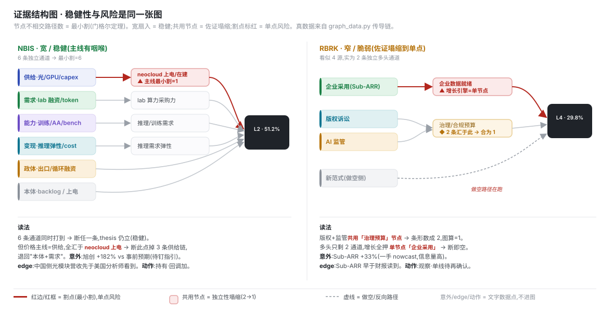

 

 

**“计算的范式不一定是重生成，而是重决策、压缩、预测。我们不仅是在解一道题，更是为基金未来的投资体系，去设计下一代的数据与决策基建。”**

[阅读指南](#-面试官阅读指南) • [第一部分：破题](#i-破题与定位信息降维与需求锚定) • [第二部分：建模](#ii-实体建模与-intelligence-graph-计算范式) • [第三部分：落地](#iii-三层架构落地与工程体系) • [第四部分：终局](#iv-终局数据资产沉淀与未来迭代)

---

## 📌 面试官阅读指南

本仓库展示了从破题拆解、范式推演到系统落地的完整过程。为获取最佳阅读体验，建议您：

1. **[本页 (README.md)](#)**：总览核心逻辑。详述系统的设计哲学、多学科建模视角（图论/运筹）、以及基于 Intelligence Graph 的计算范式。
2. **[docs/22-解题思路与分工.md](docs/22-解题思路与分工.md)**：按我真实的思考顺序，还原十个核心环节的“决策流”与“人机分工”。
3. **下钻查阅 (按需)**：
   - 🔍 **底层数据源与处理链路**：[docs/21-数据来源说明](docs/21-数据来源与处理方法说明.md)
   - 🤔 **每个分叉的思考备选**：[docs/23-取舍明细](docs/23-解题思路.md)
   - 📊 **从最终用户视角出发的呈现**：[日历式看板 Demo](assets/16-AI发展监测日历.html)
   - 💻 **工程基建与 DuckDB 复现**：[pipeline/README.md](pipeline/README.md)

*(注：`docs/13`、`docs/process/` 及 `research/` 目录为早期探索过程稿，请勿作为入口)*

---

## I. 破题与定位：信息降维与需求锚定

> **核心思路**：拒绝全网抓取噪音。从基金真实持仓反向逆推，利用信息在产业链中的降维，获取华尔街难以企及的领先期（Lead Time）与前瞻预测（Nowcast）优势。

“监测 AI 发展”极易失焦，我们需要的是能够支持最终投资决策的因果链。我的破题逻辑包含两重关键拆解：

*   **🔍 需求侧锚定 (Demand-anchored)**：必须从基金当前的 13F 真实持仓（如 NBIS、RBRK）及未来目标票池出发，反向逆推我们需要监测的 AI 节点。通过将“AI 供给”与“持仓需求”进行科学溯源的对接，系统过滤出了高信噪比的候选池。
*   **📉 信息降维 (Information Funnel)**：从 Science Lab 到创业公司再到上市公司的演进，是一个信息降维的漏斗。追踪这个降维过程的核心价值，在于获取**领先期 (Lead Time)** 与**信号的确定性**——早期的非结构化科研突破，最终必将降维成清晰的商业 KPI。
*   **✨ 锁定核心优势 (Extra Value)**：结合上述两点，系统准确定位了差异化优势——利用中国供应链地面数据（如光模块排产）的时间差与前瞻性，去精准预测（Nowcast）美股 KPI，并据此拆解实现了所需的资源与路径。

---

## II. 实体建模与 Intelligence Graph 计算范式

> **核心思路**：面对极度非结构化、频率错位的底层数据，系统借鉴多学科视角将其抽象为“点与边”，并接入 Intelligence Graph 范式，将大模型的开放式生成收敛为可量化的分类与路由。

**1. 直面数据的物理特征**
在确定观测信号池后，系统针对真实底层数据的三大痛点建立了处理基建：
*   **非结构化极其严重**：建立强制降维规则，将形态各异的输入（Paper、宏观政策）压缩为标准化的事实表征。
*   **更新频率存在错位**：前沿突发事件与财报季度披露存在时差。系统必须具备跨周期对齐能力，通过计算“领先期（Lead Time）”抹平频率差。
*   **信噪比参差不齐**：建立严密的五级溯源体系（P1-P5）和八步处理 Pipeline。
*(注：受限于时间，本轮重点实证了 NBIS 等持仓，但针对整体大盘的收集规范与处理体系已全部落定，详见 [数据来源与处理方法说明](docs/21-数据来源与处理方法说明.md)。)*

**2. 多学科视角下的点边建模**
面对清洗后的数据，系统完成了实体建模：
*   **点 (Nodes)**：AI 供给侧拆解为 7 个维度及前沿雷达。指标仅存定义，严格区分于事实本身。
*   **边 (Edges)**：借鉴**图论**视角，边不仅代表关联，更具有方向、权重和脆弱性（如通过计算供应链“最小割”直接定位风险咽喉）；借鉴**运筹学与信息论**视角，量化信号的确定性衰减。每条边历经 T1(可回测)/T2(对账)/T3(定性) 三层验证（[`edge_registry` ↗](pipeline/SCHEMA.md#tbl-edge_registry)）。

**3. 范式升华：Intelligence Graph (四算子)**
> *灵感参考：孟醒《JEV火了，但真正重要的不是JEV》——“统一接口（Token）不等于统一计算。能通过 Generation 表达的智能，不意味着都应该通过 Generation 计算。”*

为了进行投资判断，我们不需要大模型去“写一篇 3000 字的生成式研报”。在投研这种 Decision-native 的场景中，**开枪（最终扣扳机）是极低频的，但瞄准（信息筛选、验证、路由）是极高频的。** 如果每一次微小的判断都启动昂贵的自回归生成器，系统经济学将彻底崩溃。

因此，系统摒弃了单纯的 Prompt Engineering，转向 **Intelligence Orchestration（智能编排）**。我们将点边模型接入了由四个算子组成的计算循环（Compute Graph）：
*   **REPRESENT (表征)**：这是耗时最长、最依赖 Harness 的一步。将外部非结构化的长文、研报，压缩成 Point-in-time 的标准化状态，提取出 Deterministic 的事实。
*   **PROPOSE (提出候选)**：当数据出现背离时，沿传导边展开，枚举出所有可能影响持仓的因果解释（是创始人夸大？还是行业普遍降价？）。
*   **PREDICT (预判)**：结合领先期评估该信号对未来 KPI 的影响幅度。
*   **SELECT (选择与剪枝)**：在这个阶段，系统不再生成废话，而是直接对有限的候选空间进行概率打分（Scoring），通过证伪与影响力双重闸门，剪枝剔除无效假设。

---

## III. 三层架构落地与工程体系

> **核心思路**：理论范式必须应对真实工程中的摩擦力。系统被切分为三层实体架构，以实现事实与假设的绝对解耦、AI 模型的可控管理（白盒化），以及向研究员直觉的高效折叠。

### 1. 数据层：事实与假设的解耦 (Data & Pipeline)
在投研中，最危险的是将主观预判当成客观事实。工程上必须做到物理隔离：
*   **绝对真实的底层**：底层只存储绝对干净的、遵循 P1-P5 溯源的事实记录（[`source_master` ↗](pipeline/SCHEMA.md#tbl-source_master)）。
*   **假设台账 (Assumptions Ledger)**：所有涉及主观预判的传导概率与权重系数，全部分离存入独立的“台账”（[`assumption` ↗](pipeline/SCHEMA.md#tbl-assumption)）。预测出现偏差只需调参，真实数据链绝不被污染。
*   **自动化入库**：严格分离指标定义与四类事实表，按 `采集 → 快照 → 抽取 → 路由 → 校验 → 迁移` 的 Pipeline 自动流转。

### 2. 治理层：执行路由与白盒化管理 (Governance)

为了将 AI 从黑盒转变为可管理的系统组件，控制流被明确切分：
*   **三路执行路由**：确定性逻辑交给 **Code**（如关系映射、规则计算）；复杂的语义压缩交给 **LLM**；而最终的信号定档与方向复核，必须交由 **人工** 兜底。
*   **Agent Trace (设想与规划)**：未来的规划是全面接入 Langfuse。通过留存每一次 Prompt 与 Output 形成观测轨迹，并建立 Eval 机制对模型分类准确度持续打分，确保高精度数据资产沉淀。

### 3. 呈现层：消费者视角的折叠 (Presentation)
底层执行着复杂的图计算，但系统的出口必须向研究员的自然投资直觉进行折叠，隐藏底层的复杂结构。
*   **日历式主视图与影响卡 (Impact Card)**：抛弃给数据管理者看的复杂 Schema，极简为三个核心决策信息：事件本体描述（这是什么）、传导对象与权重（影响谁）、验证逻辑的时间点（下一步盯什么）。（👉 [点击查看 Demo](assets/16-AI发展监测日历.html)）

---

## IV. 终局：数据资产沉淀与未来迭代

> **核心思路**：真正的护城河不是单次的个股预测，而是系统自身的运行纪律。基于对当前系统断点的诚实诊断，我们将把这套单票验证工具，迭代为全域数据资产引擎。

### 4.1 闭环实战验证 (以 NBIS 为例)

  

*   **供需对账**：通过追踪算力猛建（光模块排产）与 需求降温（Lab融资），两端对账形成冲突预警，成功**证伪**了管理层的乐观发言。
*   **持续监测**：`checks.py` 执行严苛的 30+ 项一致性断言；`change_log` 沉淀字段级修改账本；数据链失效时，`v_health` 视图第一时间预警。

### 4.2 当前系统的断点与缺陷诊断
1. **回测深度不足，系数仍为假设**：目前的周频/季频数据多为近期的点状快照，缺乏历史时间序列。这导致“点边模型”中的权重和传导系数，绝大多数仍是停留在“假设台账”里的主观先验，无法达到 T1 级别的量化验证。
2. **缺乏自动化调度与排队机制**：虽然架构规划了 Code/LLM/人工的分工，但由于没有引入调度器，数据的采集、抽取和入库尚未形成真正的自动化流转。
3. **LLM 结果缺乏闭环监控**：目前的判断层多为 AI 初稿，但对 LLM 提取的准度缺乏系统的评估（Eval）和反馈循环。

### 4.3 下一步的迭代路径与资源需求
针对上述断点，下一步的演进路径及所需资源如下：
1. **数据纵深回填与系数标定**
   *   **行动**：向历史回溯，补齐过去数个财季与周期的底层数据。
   *   **资源与工具**：需要额外的历史研报、行业数据库授权（如海关历史明细），以及用于大批量回测标定的算力资源。有了历史序列，我们才能将主观假设替换为统计显著的客观系数。
2. **打通自动化调度与 Eval 闭环**
   *   **行动**：引入工作流调度器（如 Airflow 或 Prefect），实现数据管道的定时、自动流转。同时，真实落地 Langfuse，收集 LLM 犯的错形成专属数据集，优化分类与抽取的准确度。
   *   **资源与工具**：需要云端的编排工具基建，以及早期需要更多的人力介入复核，以完成初期 Eval 数据集的标注。
3. **横向扩展：从单票样板到全域资产**
   *   **行动**：在上述基础设施（数据深度、调度、监控）跑稳的前提下，将 NBIS 的迁移脚本与处理逻辑复制到其他通用 AI 标的与未来目标票池中。
   *   **目标**：将这套被验证过的生产线，以极低的边际成本横向复制，最终实现从“验证当前持仓”向“自动推演并发现未来投资机会”的系统升级。
