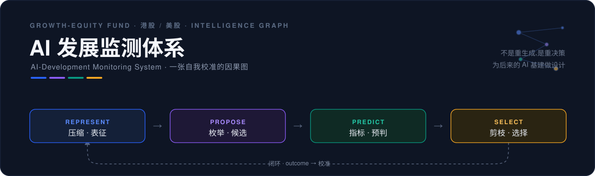
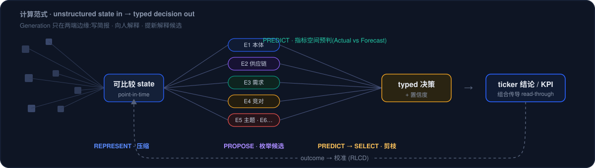
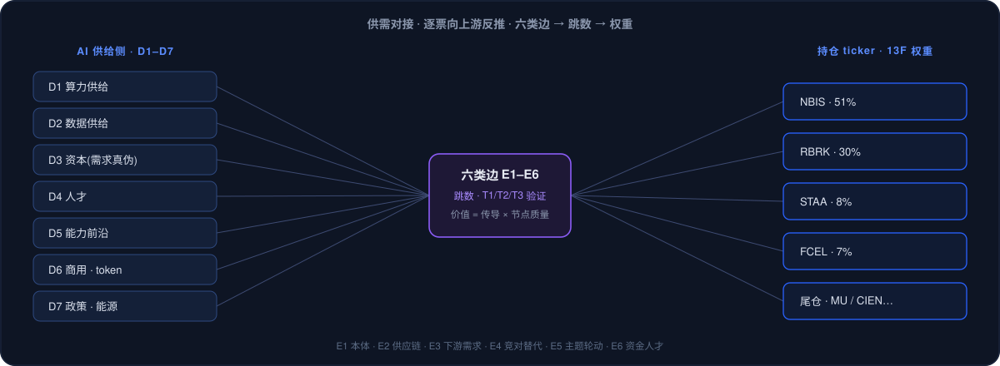

<div align="center">



<br/>


</div>

> 面向成长股基金(港股 / 美股)的 **AI 发展监测体系**:把一条 AI 前沿动态压成可计算的表征,沿因果链传导,导向具体持仓 ticker 与可观测 KPI——全程可信、可溯、可纠、可校准。
>
> 它不是"一个会写研报的 AI",而是一张**自我校准的 Intelligence Graph**。

## 目录

- [设计出发点 · 为什么是一张 Intelligence Graph](#design)
- [这套映射是怎么长出来的 · 从供需对接到因果图](#build)
- [四算子 ↔ 现有 schema(点落点看字段结构)](#operators)
- [目录结构](#layout)
- [如何运行](#run)
- [数据模型(五层)](#datamodel)
- [方法与分工](#roles)
- [数据说明](#datanote)

---

<a id="design"></a>

## 设计出发点 · 为什么是一张 Intelligence Graph

<div align="center">

</div>

这套体系的出发点,是一个关于**计算范式**的判断:

> **能用 Generation 表达的智能,不一定应该用 Generation 计算。**

有时候我们需要的不是更多的**生成**,而是把复杂、多源、口径不一的信息,**以合适的形式压缩到一个 pattern 表征**里(REPRESENT),在此之上枚举候选、做预测(PREDICT),再高频地**剪枝、选择**(SELECT),通过这样一个范式**验证一个又一个决策节点**——最终形成的,是一条推理链条,以及塑造整条「表征 → 预测 → 剪枝 → 选择 → 迭代」链路的**权重**。

投研恰好是最典型的 **decision-native**(而非 generation-native)工作负载:每个节点的输入 state 很复杂(多源证据、可信度、口径是否可比),输出却是**有限候选上的一个选择 + 一个置信度**。所以结论不是"我们要用某个模型",而是——**基金的投资体系本身应该按这个计算范式来设计**:重决策、压缩、预测、剪枝;生成只在图的**边缘**出现(写简报、向人解释、提出新的解释候选)。

- **候选空间是被设计出来的,不是天生的**:常规投研里,"AI 发展 → ticker"的分析(按供应链、按竞对……)本质上就是在一个人工枚举的候选空间里工作。把它显式化成一张图,这个空间才可以**扩张、细化、校准**——甚至整个基金的投资体系都可以采用这种形式。
- **compute 的执行者不必是通用大模型**:它可以是 *for-representation / for-prediction / for-selection* 的专用**小模型**。schema 只声明每个决策点的 **typed I/O 契约**,执行者(人 / 通用 LLM / 专用模型 / 规则代码)是**可替换件**。
- 押注的是 **Computation Specialization,而非 Model Specialization**。所以**今天的每一行数据,同时是明天专用模型的 I/O 契约与训练集**——这就是"**为后来的 AI 基建做设计**"的具体含义。

> 这套计算范式的判断,**启发自孟醒的文章 [《JEV 火了，但真正重要的不是 JEV》](https://mp.weixin.qq.com/s/m2NUWypKHN3Lv857aNVhSg)**(公众号「孟醒的笔记本」)。我读后的设计立场——四算子如何落到本体系的 schema——见 [`pipeline/JEV-intelligence-graph.md`](pipeline/JEV-intelligence-graph.md)(文章原文存档 [`pipeline/JEV`](pipeline/JEV))。

---

<a id="build"></a>

## 这套映射是怎么长出来的 · 从供需对接到因果图

<div align="center">

</div>

要让"AI 发展 → ticker"的朴素逻辑(供应链、竞对……)能扩张、能校准,就得把它一步步搭成一张真正的图。这套「AI 发展 → 基金 ticker」映射的真实构建路径如下(每步附过程稿;⑤⑥ 为整理后的面试版,①–④ 为原始工作稿):

| 步 | 做了什么 | 过程原稿 / 落点 |
|---|---|---|
| ① 供给侧建模 | 把 AI 发展拆成 **D1–D7 七维节点**(算力 / 数据 / 资本 / 人才 / 能力前沿 / 商用 / 政策·能源),每维一条"拆解主轴"保证查全 | [`3-AI侧`](research/3-AI侧1.md) |
| ② 需求侧建模 | 每只持仓票的驱动指标、关注点与可观测量 | [`4-指标测`](research/4-指标测1.md) |
| ③ **供需对接** | 把 AI 节点 × 持仓 ticker 连成一张有向图(即上图 bowtie) | [`5-AI×指标结合`](research/5-AI%26指标侧结合1.md) |
| ④ schema 设计 | 把节点 / 边 / 事实 / 判断落成可计算的表(四类 fct、R 指标、E 边、判断表) | [`6-schema1`](research/6-schema1.md) · [`8-schema_AI`](research/8-schema_AI.md) · [`schema.sql`](pipeline/schema.sql) |
| ⑤ **点 · 边 · 权重(映射范式)** | 逐票向上游反推 · 六类边 E1–E6 · 跳数 · **映射价值 = 传导确定性 × 节点质量** · 边确定性三层验证 T1/T2/T3 → `edge_registry` | [点·边·权重(整理稿)](docs/process/05-映射范式-点边权重.md) · [`edge_registry` 字段 ↗](pipeline/SCHEMA.md#tbl-edge_registry) |
| ⑥ 实例验证 | NBIS 七条链(光互连 / 在建强度 / 上电 / lab 融资 / 能力→推理 / 政策审批 / 出口管制)逐链核对,真实数据走一遍 | [NBIS 实例(整理稿 · 真数 + 已兑现)](docs/process/06-NBIS实例.md) |

**正是这套具体逻辑,才被抽象成四算子 Intelligence Graph**:供需对接 = REPRESENT + PROPOSE 的雏形,点-边-权重打分 = SELECT,逐票向上游反推 = 在候选空间里剪枝。下一节是它到 schema 的正式对应。

---

<a id="operators"></a>

## 四算子 ↔ 现有 schema(点落点看字段结构)

> 「落点」列里带 ↗ 的表名可点击,直接跳到 [`pipeline/SCHEMA.md`](pipeline/SCHEMA.md) 对应表的**字段结构**(列 · 含义 · 设计出处 · 有值率)。

| 算子 | 含义 | 在本体系的落点 |
|---|---|---|
| **REPRESENT** 压缩表征 | 把混乱世界压成 point-in-time、可比较的 state | [`stg_observation`↗](pipeline/SCHEMA.md#tbl-stg_observation) → 四类 [`fct_*`↗](pipeline/SCHEMA.md#tbl-fct_quant) + 通用元数据层(knowledge_time / P1–P5 / anchor / snapshot_id / owner)· [`source_master`↗](pipeline/SCHEMA.md#tbl-source_master) |
| **PROPOSE** 枚举候选 | 扩张候选空间:新解释、新机制从哪来 | [`edge_registry`↗](pipeline/SCHEMA.md#tbl-edge_registry) 六类边 E1–E6(本体 / 供应链 / 需求 / 竞对 / 主题 / 资金人才)· 前沿雷达 · [假设台账↗](pipeline/SCHEMA.md#tbl-assumption) |
| **PREDICT** 指标预判 | 在指标空间(而非文本)预判后果 | [`metric_registry`↗](pipeline/SCHEMA.md#tbl-metric_registry).lead_time_est · expectation_base(Forecast)· [日历排期↗](pipeline/SCHEMA.md#tbl-calendar) · warning = τ·l·e |
| **SELECT** 剪枝选择 | 有限候选上的高频判断:路由 / 分级 / 验证 / 排序 | 接入路由 · [`observation_direction`↗](pipeline/SCHEMA.md#tbl-observation_direction) · 两道闸(可信度 → 重要性)· 三态对账 · `tradable`/`warning` 排序 |
| **闭环** 自我校准 | confidence → outcome → 校准曲线 | [`decision_log`↗](pipeline/SCHEMA.md#tbl-decision_log) 六元组 · `v_calibration` · [`decision_registry`↗](pipeline/SCHEMA.md#tbl-decision_registry).calib_status 状态机(human → shadow → assisted → auto) |
| **分工即 routing policy** | 确定性代码 → 专用判断 → 小生成模型 → human 的 cascade | AI 生成 / 分析师复核 / 数据团队,**边界随校准数据移动** |

---

<a id="layout"></a>

## 目录结构

```
AI-Monitor-Fund/
├── README.md                本文件
├── pipeline/                工程核心:真值源库 + 代码 + 迁移 + 视图 + 校验
│   ├── anatole_ai_monitor.duckdb   真值源(29 张表 + 视图)
│   ├── schema.sql · views.sql      表结构 / 可推导视图
│   ├── init_db.py · migrate.py · checks.py   建库 / 改库 / 校验
│   ├── core.py · db_read.py · directions.py · factors.py · entities.py · metadata.py
│   ├── migrations/                 0000_bootstrap → 00NN,一次改库 = 一个脚本
│   ├── snapshots/                  来源原文本地快照(证据,snapshot_id = 文件名)
│   ├── build_dashboard2.py · build_panel.py · gen_browser.py · gen_schema_doc.py
│   ├── PIPELINE.md · SCHEMA.md · README.md    运行机制 / 字段字典 / 数据岗手册
│   └── JEV-intelligence-graph.md · PANEL-DESIGN.md · UI-SPEC.md · …   方法与设计文档
├── data/
│   ├── tables/              7 张建库底稿 CSV(建库后冻结,改数走 migrations)
│   └── Anatole_13F_2023Q2-2026Q2_1.xlsx   持仓 13F
├── docs/                    顶层方法 / 协作日志 / 信息架构文档
├── research/                研究过程:AI 侧 · 指标侧 · 供需结合 · schema 演进 · 映射 · NBIS 实例 · 假设
├── submission/             题目 · 二面记录 · 合伙人背景与岗位画像
└── assets/                  独立 HTML 产出(监测日历 · schema 浏览器)· readme 图形
```

---

<a id="run"></a>

## 如何运行

**环境**:Python 3 + DuckDB。

```bash
pip install duckdb
```

**应用改库并校验**(日常):

```bash
cd pipeline
python3 migrate.py          # 应用 migrations/ 里未应用的脚本,刷新视图
python3 checks.py           # 业务规则校验:ERROR 必须为 0,WARN 逐条看
```

**从零复现真值源**(bootstrap + 重放全部改库脚本,结果与增量应用一致):

```bash
cd pipeline
python3 init_db.py --force  # 从 ../data/tables/ 的底稿 CSV 建库
python3 migrate.py          # 重放 0001…00NN
python3 checks.py           # 应得 ERROR 0
```

**生成产出**:

```bash
cd pipeline
python3 gen_schema_doc.py   # 库 → SCHEMA.md(每列有值率 + 每表锚点)
python3 gen_browser.py      # 库 → schema_browser.html(按思路 / 按数据层双视图)
python3 build_dashboard2.py # 库 → panel_v2.html(数据管理者面板)
```

**在副本上测试**(不动真值源):设 `ANATOLE_DB` 指向库副本,`ANATOLE_MIGRATIONS` 指向私有迁移目录。

---

<a id="datamodel"></a>

## 数据模型(五层)

| 层 | 表 / 视图(带 ↗ 的可点击看字段结构) |
|---|---|
| 接入 | [`stg_observation`↗](pipeline/SCHEMA.md#tbl-stg_observation)(一行一个事实,人 / agent 的登记格式) |
| 资产 | [`entity_master`↗](pipeline/SCHEMA.md#tbl-entity_master) · [`metric_registry`↗](pipeline/SCHEMA.md#tbl-metric_registry)(R,指标定义)· [`edge_registry`↗](pipeline/SCHEMA.md#tbl-edge_registry)(E,六类边 × 跳数 × T1–T3)· 四类事实 [`fct_quant`↗](pipeline/SCHEMA.md#tbl-fct_quant) / [`fct_event`↗](pipeline/SCHEMA.md#tbl-fct_event) / [`fct_opinion`↗](pipeline/SCHEMA.md#tbl-fct_opinion) / [`fct_frontier`↗](pipeline/SCHEMA.md#tbl-fct_frontier) · [`source_master`↗](pipeline/SCHEMA.md#tbl-source_master) |
| 治理 | [`assumption`↗](pipeline/SCHEMA.md#tbl-assumption) · [`coefficient`↗](pipeline/SCHEMA.md#tbl-coefficient) · [`metric_factor`↗](pipeline/SCHEMA.md#tbl-metric_factor)(r/e/l/s/φ)· [`observation_direction`↗](pipeline/SCHEMA.md#tbl-observation_direction) · [`key_fact`↗](pipeline/SCHEMA.md#tbl-key_fact) |
| 治理·决策层 | [`decision_registry`↗](pipeline/SCHEMA.md#tbl-decision_registry)(每类重复判断的 I/O 契约 + calib_status)· [`decision_log`↗](pipeline/SCHEMA.md#tbl-decision_log)(六元组:state_anchor / candidates / choice / confidence / basis / outcome)· [`candidate_pool`↗](pipeline/SCHEMA.md#tbl-candidate_pool) |
| 元数据 | [`schema_doc`↗](pipeline/SCHEMA.md#tbl-schema_doc) · [`migration_log`↗](pipeline/SCHEMA.md#tbl-migration_log) · [`change_log`↗](pipeline/SCHEMA.md#tbl-change_log) · [`thesis_node`↗](pipeline/SCHEMA.md#tbl-thesis_node) · [`decision_fork`↗](pipeline/SCHEMA.md#tbl-decision_fork) · [`artifact_anchor`↗](pipeline/SCHEMA.md#tbl-artifact_anchor) |

完整字典见 [`pipeline/SCHEMA.md`](pipeline/SCHEMA.md);运行机制见 [`pipeline/PIPELINE.md`](pipeline/PIPELINE.md);数据岗操作见 [`pipeline/README.md`](pipeline/README.md)。

---

<a id="roles"></a>

## 方法与分工

每条判断在库内显式标注执行者:**AI 生成 / 分析师复核 / 数据团队**(`decision_log.executor_kind`),配合 `calib_status` 状态机(human → shadow → assisted → auto):**未经校准验证的判断不得自动化,其输出禁用于 sizing 与告警阈值**。这既满足题目对 AI / 人分工的要求,也让整套推理链可审计——而这张"谁在什么置信度下执行什么判断"的表,就是这套 Intelligence Graph 里最难被复制的部分。

---

<a id="datanote"></a>

## 数据说明

本仓库为面试提交材料。市场 as-of 模拟至 2026-09;库内数据混合**真实公开事实**(公开披露的 hyperscaler capex、光模块厂商半年报、benchmark 榜单等)与为演示构造的**示例值**。每条记录的来源、来源等级与可知时间见 `source_master` / `provenance` / `snapshots/`;引用具体数字请回第三方原文核对。
