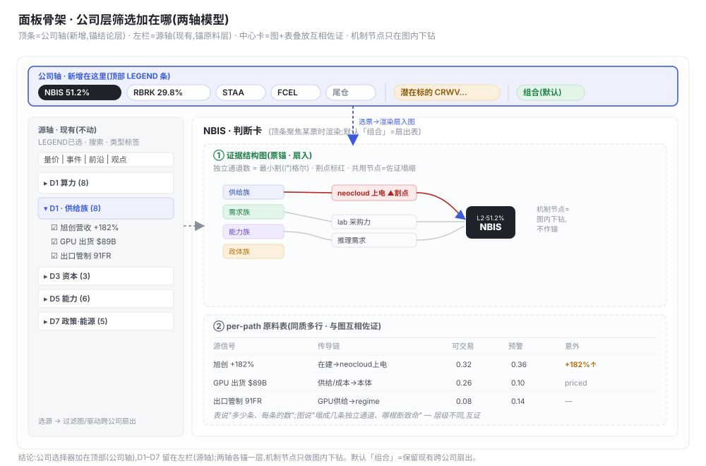

# 19 · 判断层设计:从边到票的判断 + 最优呈现形式(2026-09-21)

原则:判断层是**方法的产出**,不是方法论展示。它把 propagate 出来的一堆边(per-path)**聚合成对每只票的一句话结论**,并给出每种洞见**天然的呈现形式**——不是把所有东西塞进一张越加越宽的表(列是浅层信息)。

判断层分**两级**,表与图**信息层级不同、互相佐证,缺一不可**:
- **B1 · per-path 原料表**(边级,同质多行):每条传导路径一行,回答"有多少条、每条的数"。
- **B2 · per-ticker 证据结构卡**(票锚,少数几张):回答"这只票的 thesis 被几条独立证据撑、哪根断最致命、edge 在哪、加还是减"。

---

## 1 · 两级结构

### B1 原料表(表的天职:同质可扫描)
一个源信号 → 若干条路径,每条一行。字段全部来自 `edge_registry` / `v_edge_calc`:

| 字段 | 含义 | 来源 |
|---|---|---|
| 落点票 | 这条路径打到哪只 | edge_registry.ticker |
| 传导链 | 中间机制节点(去重词表 MECH) | graph_data.CHAINS |
| 边类型 / 跳数 | E1–E6 / hops | doc25 §1.2 |
| 方向 / 确定性 | ↑↓! / T1–T3 | v_edge_calc |
| 可交易度 / 预警度 | c·r·s·φ / τ·l·e | v_edge_calc |
| **意外** | 实测 vs **事前预期**(符号+幅度) | decision_log(见 §6) |
| priced / variant | 是否已被市场定价 | 我方 choice vs 共识 |

表说"多少条、每条多少分";它**看不出**这些路径其实是不是同一回事——这正是需要图的地方。

### B2 证据结构卡(图 + 表 + 文字)
每票一张卡:**证据结构图**(结构)+ 下方 stat 表(数)+ 文字头条(结论)。这是 extra-value 的集中地。

---

## 2 · 证据结构图:稳健性与风险是同一张图

源 → 机制 → 票的小传导图。核心量都是**拓扑**,只有图能原生承载:

- **佐证度 / 独立通道数** = 源到票的**节点不相交路径数**。
- **稳健性 = 最小割**。由**门格尔定理**,`节点不相交路径数 = 最小割大小`——**同一个计算,同时给出"多稳健"和"哪个节点最致命"**。
- **冗余折叠**:共用中间机制的路径(旭创 + 新易盛都走 `neocloud 上电`)**并入同一节点去重**,不重复计佐证。
- **割点标红** = 关键风险单点。

**真数据(graph_data.py 传导链):**
- **NBIS**:~6 条节点不相交通道(供给/需求/能力/变现/政体/本体)→ 宽、稳健。但价格主线(供给)全汇于 `neocloud 上电` → **主线最小割 = 1**,这是该盯的运营咽喉。
- **RBRK**:看似 4 源,但**版权诉讼 + AI 监管两条都汇到 `k_gov_budget`(治理预算)节点** → 实为 **2 条独立多头通道**;增长引擎是**单节点「企业采用」**;另有一条做空路径(新范式)在跑 → 脆弱。

> 严谨性教训:**独立性要按共享节点算,不是按 dim 数**。按维度数会把 RBRK 数成"4 族",条形图会骗人;图(和节点不相交计算)才说真话。

---

## 3 · 最优呈现形式:按洞见的天然形状,不硬塞列

| 洞见 | 天然形状 | 形式 |
|---|---|---|
| 佐证度 / 最小割 / 冗余折叠 / 枢纽 | 拓扑 | **图**(证据结构图,唯一真正需要图的地方) |
| 意外 / lead / 信息增益 / 拥挤度 | 一维量 | **数据点**(行内数字) |
| edge / 净thesis / 动作 / runway / 证伪 | 论断 | **文字** |
| priced / variant / CN先看 | 类别 | **tag chip** |
| per-path 原料 | 同质多行 | **表**(只在 B1) |

一句话:**判断层从"越加越宽的表"改成"每票一张判断卡";列砍掉,表只留给下面的原料层。**

---

## 4 · 两轴导航:公司轴 + 源轴

传播图有三类节点——**源信号 / 机制 / 公司**,能从两端锚:

- **源锚 = 扇出**(1 信号 → 多票),PROPOSE,事件监控视角 → **左栏 D1–D7 源轴**(现有)。
- **票锚 = 扇入**(多信号 → 1 票的稳健性),SELECT / 综合,持仓管理视角 → **需要公司选择器**(新增)。
- **机制节点**:永远是中间,只作**图内下钻**(点它看"谁喂它 / 断它坏谁"),不作顶层锚。

**公司选择器加在顶部(公司轴),不混进 D1–D7 源树**,理由:①公司≠源是两种对象,混进一个多选会出歧义语义;②它们索引不同层——顶条锚结论层(综合卡),左栏锚原料层(扇出表);③默认「组合」= 跨公司扇出(比 TickerTrends 多出来的差异化,不能丢)。顶条范围:持仓常驻(NBIS/RBRK/STAA/FCEL/尾仓)+ 潜在标的(≥T2/P2 的仓外命中)下拉。

---

## 5 · extra-value ↔ 层映射(信息论 / 图论 / 博弈论)

这些 extra-value 绝大多数落在 **B2 聚合级**(不在边级),因为它们全是"聚合"的产物:

| 层 | extra-value | 怎么体现 | 数据源 |
|---|---|---|---|
| 源数据层 | 信息增益排序 | 左栏按 Δ不确定性排(替掉按 raw 大小) | 目标KPI + 先验熵 |
| 源→图 | 中心性 / 枢纽机制 | 枢纽 top-N;图中 node 按 betweenness 放大 → 决定监测预算给谁 | networkx betweenness |
| B1 | **意外** | 每行头号数字**换成**"实测 vs 事前预期"(非新列) | decision_log |
| B1 | priced / variant | 路径 tag | choice vs 共识 |
| B1 | 信息不对称 / lead | lead 数据点 + CN 源标 | 源档 registry |
| B2 ★ | 佐证度 + 稳健性 | 证据结构图 | node_connectivity |
| B2 ★ | 最小割 / 风险节点 | 图内割点标红 | articulation points |
| B2 ★ | 冗余折叠 | 并入共享节点去重 | 共享 MECH 检测 |
| B2 | 反身性 | regime 节点上人工判断 flag + 文字 | decision_log(人工) |
| B2 | edge / 信息不对称 | 文字行(一等公民,最该标) | lead / 源 |
| B2 顶 | 净thesis+动作+runway+证伪 | 文字头条 | 聚合 + key_fact |
| Insight层 | 拥挤度 / crowding | 13F 重合 + 我方 13F 轮动 | 13F + positions |
| 决策层(引擎) | 意外/variant/反身性 的严谨性 | 计算源:事前登记预期→才有意外 | decision_registry/log/candidate_pool |

---

## 6 · 意外的严谨性 ⟹ 决策层是引擎

"意外" = `decision_log` 里**事前登记的预期(candidates)− 实测(outcome)`,不是"raw 值大";是把 per-path 头号数字从 raw **换成**意外,不是新增浅层列。这也化解了"别加列"与"缺意外列"的矛盾:同一格,换内涵。

数据依赖(先说清,免得做成事后诸葛):多数信号现在**没有事前预期基线**。B2 落地时意外这一格初期用**卖方一致 / 上期同比**做代理预期并显式标注「代理」,等决策层把事前预期养起来(见 [20-执行路由与校准闭环](20-执行路由与校准闭环.md))再切真值。

**落地:** B2 接真库——`graph_data.py` 跑 networkx `node_connectivity` / 割点自动生成图,per-path 表拉 `v_edge_calc`,意外从 `decision_log` 算;顶条公司轴接 positions。图和表都是**库产出**,不是示意图。
